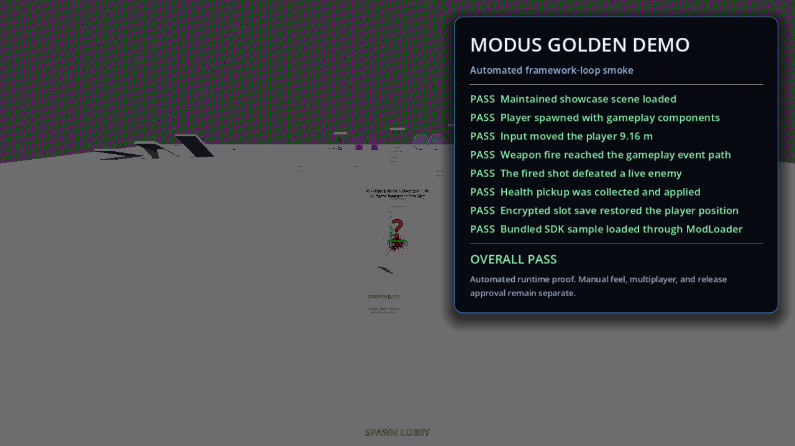

# MODUS Framework

> **Documentation status: maintained reference.** Published readiness is consolidated in `docs/DOCUMENTATION_TRUTH.md` and `docs/CURRENT_STATUS.md`. Generated reports are local invocation records; narrower claims in this file apply only to the named subsystem or workflow.

MODUS is an experimental Godot 4.7 multiplayer FPS framework and playable mechanics lab for developers who still care how guns feel, movement flows, enemies pressure space, and levels create stories.

If you like boomer shooters, arena shooters, looter shooters, procedural maps, co-op experiments, or games that expose their systems instead of hiding them behind a black box, MODUS is built in that direction.

It combines fast FPS combat, movement, weapons, loot, enemy AI, procedural map generation, splitscreen, multiplayer foundations, a level editor, and a modding SDK in one inspectable project. Build a tight combat room, a procedural gauntlet, a strange weapon pack, a custom enemy faction, or a ruleset that changes how the whole game behaves.

**Version:** `0.9.5-beta`

**Engine:** Godot 4.7+

**Readiness:** **NOT READY**

MODUS is not presented as a shipped game or production-ready SDK. Manual gameplay evidence, release packaging, Workshop publication, and broader external runtime validation remain open. The project keeps those boundaries visible while the underlying systems are developed and tested.

## Read This Before Cloning

MODUS is a developer project, not a ready-to-play Steam game and not a one-click Godot template. Expect to inspect source, install the matching tools, wait for Godot imports, and validate the path you care about.

The parts most likely to frustrate you:

- There is no published release, signed installer, configured Workshop item, or bundled GodotSteam extension. Local Linux exports and an integrity-checked portable install/upgrade/uninstall helper are available; these are not a supported public download.
- The expected environment is Godot 4.7 in the 4.7 line on a writable machine with Bash; the repository does not pin a portable editor binary.
- First launch performs asset imports and may expose renderer, driver, or missing-integration issues before the main scene is usable.
- Optional Steam/GodotSteam and Voxel Tools integrations may be unavailable. Fallbacks keep some paths running but do not provide feature parity.
- The Showcase route is an automated smoke path, not proof that the game feels good. Manual gameplay evidence is still zero reviewed hours.
- Multiplayer proof is strongest on local ENet and focused authority contracts. WAN sessions, Steam, Workshop, target-Windows, graphical exported-editor acceptance, and long-session proof remain open.
- The current release line is `0.9.5-beta`; production readiness is explicitly **NOT READY**.

If you want a polished game to play immediately, MODUS is the wrong download. If you want an inspectable FPS systems lab that you can bend, profile, test, and extend, it is the right kind of unfinished.

### Release and World-Building Direction

The [release and world-building plan](docs/RELEASE_AND_WORLD_BUILDING_PLAN.md) defines the path from this systems lab to an installable product. **Breakwater Station: Black Start** now has eleven detailed mission modules, power-driven machinery/lighting, zoned original ambience, finite supplies and a powered hub-return route. The exported Linux client completes the `.mdsl` mission using real pistol fire, default movement and checkpoints; isolated native captures cover every room. Human-operated completion, audiovisual approval and first-play pacing remain open, alongside persistent hubs, installer and external-service gates. See the [human acceptance checklist](tests/docs/MANUAL_TEST_TIMING.md#black-start-production-acceptance).


## Why MODUS

MODUS takes the parts that make FPS games worth mastering:

- Boomer-shooter movement rhythm and immediate weapon feedback.
- Arena-shooter space, pressure, routes, and target priority.
- Looter-shooter variety through weapons, pickups, equipment, inventory, and modifiers.
- Procedural replayability through rooms, hallways, caves, slopes, 3D floors, navigation, and gameplay placement.
- Mod-friendly experimentation through data overrides, event exchange, script hooks, sample packages, and validation.
- Developer control through inspectable Godot scenes, configuration, editor tooling, focused tests, and server-authoritative boundaries.

The intended workflow is direct: edit a level, tune a weapon, change the data, reload the route, and test the result. MODUS is for the developer who thinks, “The gun should kick harder,” “That enemy needs to force movement,” or “I want to change the rules, not just replace a texture.”

## What You Can Build

- A fast solo FPS with handcrafted combat arenas.
- A procedural run with escalating enemies and loot.
- A co-op or splitscreen experiment.
- A custom weapons-and-modifiers sandbox.
- A mod package that changes data, events, enemies, or rules.
- A level-editor workflow that stays close to the playable result.

The project is mechanics-first: velocity, pressure, readable systems, strange weapons, and levels worth learning.

## Start Here

1. Install Godot 4.7 in the 4.7 line and ensure `godot` is on `PATH`, or set `GODOT_BIN`.
2. Clone the repository and open it with `godot --editor --path .`.
3. Wait for the first asset import; generated `.import`/`.uid` sidecars are normal and should not be deleted while Godot is open.
4. Run the configured main scene: `res://shared/ui_core/screens/main_menu_screen.tscn`.
5. Use `res://game/world/maps/showcase.tscn` for the maintained showcase route.
6. Read [Getting Started](docs/getting_started.md), [Known Limits](docs/KNOWN_LIMITS_MATRIX.md), and [Showcase Route](docs/SHOWCASE_ROUTE.md) before judging a missing feature.

For a fast source/setup check before launching the UI:

```bash
bash tools/check_documentation_truth.sh
bash tools/check_project_truth.sh
bash tools/check_headless_runner_manifest.sh
```

The repository does not guarantee a clean first run on every machine. Missing optional integrations, import issues, renderer differences, unsupported hardware, and the absence of a graphical session are environment boundaries, not silently successful fallbacks.

## Local Linux export

The repository now has a `Linux Desktop` export preset. With Godot 4.7 in the
4.7 line and the Linux export template installed:

```bash
mkdir -p standalone/client
godot --headless --path . --export-release "Linux Desktop" standalone/client/modus.x86_64
tools/run_export_smoke.sh --platform linux --executable standalone/client/modus.x86_64
```

The bounded export smoke passed on the current Linux/Godot 4.7.2 environment.
This proves one local Linux artifact launches cleanly for the smoke interval; it
does not make the artifact a release, installer, signed binary, Steam build, or
target-Windows proof.

### Local release candidates

Python 3.10+ and Bash are required for the release helpers. To package an existing Linux client:

```bash
bash tools/package_linux_portable.sh package \
  --artifact-dir standalone/client --version 0.9.5-beta --output /tmp/modus-linux.tar.zst
bash tools/package_linux_portable.sh install --archive /tmp/modus-linux.tar.zst --prefix "$HOME/.local/opt"
bash tools/package_linux_portable.sh verify --prefix "$HOME/.local/opt"
bash tools/package_linux_portable.sh uninstall --prefix "$HOME/.local/opt"
```

`.tar.zst` is the preferred transfer format for deployment; `.tar.gz` remains supported. The helper requires the `zstd` executable for `.tar.zst` archives. Install again to upgrade. The helper checks the complete archive before changing an installation, rolls back failed replacements, and preserves unowned files and XDG saves/configuration. Changed owned payloads, unsafe archives and legacy installs without the checked inventory are rejected, not deleted or silently migrated. Back up and relocate a legacy install before choosing a clean prefix.

For a client/server/editor candidate from one build revision, generate a portable manifest and stage it:

```bash
python3 tools/validate_release_artifacts.py --version 0.9.5-beta \
  --commit "$(git rev-parse HEAD)" --godot-version "$(godot --version)" \
  --root standalone --client standalone/client/modus.x86_64 \
  --server standalone/server/server.x86_64 --editor standalone/editor/modus-editor.x86_64 \
  --output standalone/release-manifest.json
python3 tools/stage_release_artifacts.py --manifest standalone/release-manifest.json \
  --output build/release/MODUS-0.9.5-beta-linux-x86_64
python3 tools/validate_release_artifacts.py \
  --verify build/release/MODUS-0.9.5-beta-linux-x86_64/manifest.json
```

Build each named export first; do not label older or mixed-revision binaries with the current commit. Staging verifies hashes before and after copying, refuses existing destinations, and requires commit/runtime identity. The candidate remains verifiable after relocation. Hashes and optional detached-signature metadata do **not** authenticate an unsigned candidate or prove native capabilities. CI and local jobs assemble this Linux candidate; run the focused release-contract checks locally before labeling a candidate. Public publication, signing, a native-dependency lock and target acceptance remain open.

The current local dogfood batch produces unsigned transfer archives at
`build/release/modus-0.9.5-beta-linux-x86_64.tar.zst`,
`build/release/modus-0.9.5-beta-linux-x86_64.tar.gz`,
`build/release/modus-0.9.5-beta-windows-x86_64.tar.zst`, and
`build/release/modus-0.9.5-beta-windows-x86_64.zip`. Each archive uses the
OVERZEER root naming contract and includes `README`, `LICENSE`, payload hashes,
the Linux `modus` client/server/editor exports, or the Windows `modus.exe`
client plus editor export. `.tar.zst` is the compact local transfer format;
OVERZEER receiver deployment currently accepts the Linux `.tar.gz` and Windows
`.zip` variants. These are local candidates, not authenticated deployments;
native Windows execution, signing, receiver authentication and target
acceptance remain required.

CI and local release jobs use `tools/package_overzeer.py` to build these
archives from verified exports:

```bash
python3 tools/package_overzeer.py package \
  --version 0.9.5-beta --target linux-x86_64 \
  --executable standalone/client/modus.x86_64 \
  --content standalone/client/modus.pck \
  --readme README.md --license LICENSE \
  --output build/release/modus-0.9.5-beta-linux-x86_64.tar.gz
```

The checked-in handoff wrapper prepares or previews the two receiver-bound
packages without reading credential contents:

```bash
OVERZEER_DOWNLOAD_BASE_URL=https://packages.example.invalid/modus \
tools/deploy_overzeer_fleet.sh preview
```

Use `deploy` only with an owner-approved HTTPS endpoint and
`OVERZEER_CONFIRM=DEPLOY`; the wrapper delegates private token discovery to
OVERZEER's canonical `oztok` root.

Before handoff, qualify the exact four archives and write deterministic local
inventory metadata:

```bash
python3 tools/validate_overzeer_release.py \
  --version 0.9.5-beta --build-id "$(git rev-parse HEAD)" \
  --root build/release --output build/release/overzeer-release.json
```

To remove only obsolete package archives while preserving the selected
version, preview first and then apply:

```bash
python3 tools/cleanup_overzeer_archives.py \
  --root build/release --keep-version 0.9.5-beta
python3 tools/cleanup_overzeer_archives.py \
  --root build/release --keep-version 0.9.5-beta --apply
```

## OVERZEER dogfood deployment and telemetry

MODUS is registered as the `modus` OVERZEER dogfood application. Its package
must use the root `modus-<version>-<target>`, executable `modus.exe` on
Windows or `modus` on Linux, plus `README` and `LICENSE`. A successful
OVERZEER deployment writes `overzeer-modus-telemetry.json` beside the active
executable. The marker is generated by the authenticated receiver, not shipped
in source archives.

The exported MODUS binary reads that marker, enables the existing local-only
JSONL telemetry, and writes sessions into the receiver collection directory.
No network transport or analytics SDK is involved. Retrieve it from Chopper:

```bash
tools/overzeer-collect.sh \
  --endpoint https://ddjarin.tail8302a.ts.net \
  --token-file ~/.config/overzeer/ddjarin-token \
  --output /tmp/modus-dogfood-telemetry.zip \
  --taildrop chopper
```

Direct launches outside an OVERZEER deployment remain opt-in:

```bash
MODUS_LOCAL_TELEMETRY=1 \
MODUS_LOCAL_TELEMETRY_DIR=/absolute/path/to/telemetry \
./modus.exe
```


## Proven Showcase Route <!-- craft-ignore: maintained project reference -->

The main menu exposes **Showcase**, which opens the maintained `game/world/maps/showcase.tscn` route. The automated golden-demo smoke now proves one controlled local framework loop: scene load, player spawn, movement input, weapon fire, enemy defeat, pickup collection, encrypted save/load restoration, and bundled SDK sample-mod loading. <!-- craft-ignore: scoped evidence emphasis -->



- Golden demo report: `docs/GOLDEN_DEMO_SMOKE.md`, generated locally by `tools/run_showcase_golden_demo_smoke.sh`
- [Short automated runtime video](docs/media/release/golden_demo_smoke_1280x720.mp4)
- [Release Evidence Bundle](docs/RELEASE_EVIDENCE_BUNDLE.md)

This route does not prove gameplay feel, real multiplayer peers, Steam, long sessions, packaging, manual hours, or release approval.

For a real reviewed session, run `tools/run_manual_showcase_session.sh --tester NAME --input DEVICES`. Its test-only F8/Gamepad Back recorder covers 20 bounded observations and writes metadata-rich CSVs directly to `logs/manual_test_logs/`; it does not fabricate evidence.

## What Exists in Source

| Area | Source-backed boundary |
| --- | --- |
| Core lifecycle | `GameManager` and `MapGenerator` are the two project autoloads |
| Gameplay | Player, combat, weapons, enemies, loot, effects, missions, difficulty, movement, and world systems are present |
| Content | Weapon, enemy, item, loot, localization, and map-generator data live under `game/data/` |
| Runtime configuration | Feature, gameplay, network, entity, item, and performance configuration live under `game/config/` |
| Networking | ENet, server validation, RPC whitelist/rate limits, dedicated-server paths, prediction, and conditional Steam structures exist |
| Splitscreen | Local-player, viewport, input, assignment, and session-management code exists with focused automated coverage |
| Modding | Folder/PCK/ZIP discovery, manifests, dependencies, overrides, event hooks, and a sample SDK mod exist |
| Editor | Shared editor core, embedded and standalone entry points, level serialization/export, prefabs, and local Workshop simulation exist |
| Map generation | Multi-phase procedural generation, validation, export, profiling, and focused unit/integration coverage exist |

“Exists in source” does not mean the complete user flow has been manually proven.

## Current Evidence

| Evidence | Result |
| --- | --- |
| Retained complete Godot/GUT suite | **PASS:** September 10 refreshed aggregate, 1,568/1,568 passing with 21,718 assertions across 135 scripts; two GUI-required files skipped |
| Latest strict aggregate attempt | **PASS/complete:** September 10 bounded run completed with the patched Godot 4.7.2 binary; known engine-exit ObjectDB diagnostics remain |
| Latest batched lanes | **PASS:** Unit 1,166/1,166; Integration 227/227 with 2 GUI-required files skipped; Property 175/175 |
| Craft / Slopometer | **PASS:** Craft penalty 0; MODUS 0.0/10 across all five dimensions |
| Golden demo runtime smoke | **PASS:** all 8 controlled framework-loop steps; automated scope only |
| Main menu / showcase scene launch smokes | **PASS:** startup scope only; see [Current Status](docs/CURRENT_STATUS.md) for dates and boundaries |
| Manual gameplay | **BLOCKED:** the recorder workflow is ready, but no reviewed CSV evidence has been imported |
| Performance evidence | **PASS** for one bounded 66.4-second/130-sample showcase capture only |
| Release-version gate | **BLOCKED** — current version remains `0.9.5-beta` |
| Production readiness | **NOT READY** with manual evidence and release-version blockers; legal/distribution clearance is a separate boundary |

Focused green tests are listed in [Current Status](docs/CURRENT_STATUS.md). They prove only their named contracts and do not replace manual, release, or distribution evidence.

The UI/UX pass now uses the supplied warrior artwork, exposes the maintained Showcase route directly, explains focused or hovered actions, preserves responsive containment and 48-pixel logical controls across shared menus/modals, localizes Showcase and Editor labels, makes options, multiplayer, host, pause, and save/load layouts shrink safely, and adds a gamepad-ready showcase welcome panel that states the evidence boundary. The mod manager now stacks on constrained screens, localizes its workflow, keeps actions disabled until selection, and explains that changes apply after reload; the skill-tree compatibility route now resolves the complete focusable UI. The test-only manual recorder adds a compact 800×600 review surface, clear Pass/Fail/Skip states, required failure notes, direct evidence export, and an F8/Gamepad Back gameplay/review handoff. Recorder/timer proof passes 2/2 with 21 assertions; captures are retained in [Release Evidence Bundle](docs/RELEASE_EVIDENCE_BUNDLE.md).

The latest focused source-shape/editor-registry contract passes 37/37 with 172 assertions and zero GUT orphans. It verifies canonical world/map/resource paths and instantiable built-in editor actors; it does not supply the still-missing vase, corpse-pile, hidden-stash, or weapon-rack loot scenes.

The advanced-movement contract now passes 36/36 with 51 assertions in focused scope and 36/36 inside the strict aggregate. It verifies deterministic grounded bunny-hop/slide behavior, capped hop acceleration, current signal contracts, no-peer-safe dodge synchronization, and canonical rocket-jump JSON5 loading; normal-window feel and tuning remain manual proof.

## Important Boundaries

### Multiplayer and Steam

- The `multiplayer_demo` profile launches without profile/service lookup errors.
- Focused real-ENet lifecycle, reconnect, latency, rate-validation, and late-join checks have dated passing evidence; representative WAN sessions and real abusive-client soak remain unproven.
- GodotSteam 4.22.1 authenticated local initialization has been observed with persona/Steam ID; two-account Steam lobbies, Workshop operations, and relay/P2P behavior remain unproven.
- Server-authoritative hitscan uses the shared, RTT-bounded player/enemy rewind system. Focused physics and weapon tests pass; client-view/interpolation calibration and representative high-latency sessions remain unproven.

See [Multiplayer Authority](docs/MULTIPLAYER_AUTHORITY_MODEL.md), [Profile Smoke](docs/MULTIPLAYER_PROFILE_SMOKE.md), [ENet Smoke](docs/ENET_LOCAL_HOST_JOIN_SMOKE.md), and [Steam Integration](docs/technical/STEAM_INTEGRATION.md).

### Editor and Workshop

- Historical constructed-level save/export/reload proof passes through `LevelSaveSystem`; it does not cover every embedded-editor path.
- Local filesystem Workshop upload/download/browse/subscription simulation passes.
- September 13 repairs embedded document replacement, nested ownership, root metadata, cursor RPC compilation and document-owned channels. Focused editor/history tests pass 36/36 with 204 assertions. Source and exported Linux editors assemble/wire three modules, play, reopen/resave and export `.mdsl`; package export now refuses an existing output without changing prior bytes. The exported Linux game completes that package without losing geometry or behavior. Graphical verification is blocked by the isolated-display pressure guard.

See [Editor Round-Trip Proof](docs/EDITOR_ROUNDTRIP_PROOF.md) and [Workshop Local Simulation](docs/WORKSHOP_LOCAL_SIMULATION_PROOF.md).

### Performance

One compatibility-renderer showcase capture exists on Intel Arc A770/Mesa: 66.4 seconds, 130 samples, and a 108.55 ms maximum frame-time spike. The historical capture emitted extreme enemy-position warnings; current enemy runtime attempts bounded recovery for those positions. Do not use its average FPS as a player-facing target.

No display-synchronized solo, splitscreen, multiplayer, low-end hardware, or long-session target has been validated. See [Performance Baseline Proof](docs/PERFORMANCE_BASELINE_PROOF.md).

### Map Generator

September 13 generator-correctness proof passes **55/55 focused tests with 1,319 assertions** on Godot 4.7.2. It covers seed isolation, connected layouts, retained keys/secrets, simultaneous-lock progression, collision-backed navigation, saved-scene routes and cancellation/restart. Separate 64×64 and default 128×128 source-generation smokes pass; the latter produces 1,405 navigation polygons. Historical unit/threading/export counts are not a current full-suite result.

Generator revision **2** changes seed-to-content output. Saved scenes retain seed, configuration, revision and typed gameplay records; replay requires the same generator/runtime/content. Generated/authored content now carries a versioned capability manifest with runtime identity, required features and explicit fallback diagnostics; destination staging and travel admission reject unsupported or mismatched capabilities before instantiation or peer spawn. Key/lock generation publishes deterministic key, lock, objective, recovery-route, room-ID and room-edge metadata; recovery routes now start from the configured player room, use a deterministic shortest extraction path or true farthest reachable fallback, disconnected graphs, forged edges and locks not backed by actual transitions are rejected transactionally, and MissionMgr accepts valid branching edges outside the recovery route, rejects disconnected declared graphs and preserves legacy manifests without room IDs. `MissionGraphPlanner` classifies linear/branching/cyclic topology and publishes stable branch metadata before lock placement. `ModuleLayoutSolver` now publishes bounded tree and cyclic spanning-tree socket transforms, bounded breadth/depth spanning-tree alternatives, connection records, loop-closure diagnostics, deterministic least-used catalog selection and clearance checks as `spatial_plan`; valid plans are attached to generated `LevelRoot` scenes through `ModuleAssembly`, which rejects duplicate rooms, malformed transforms and empty plans before mutation. Full authored catalog placement and attachment of an eleven-room chain are covered with catalog usage/diversity diagnostics, and every authored catalog definition is exercised through single-room solve/attach coverage. Generated scenes instantiate canonical enemy, pickup, key, door and extraction actors and retain packed actor-record/count diagnostics; unsupported item records remain explicit non-realization entries. Generated gameplay retains a bounded encounter manifest with proportional weapon/ammo/health floors, resource counts, room distribution and impossible-composition refusal diagnostics; health balancing preserves those floors. Packed generated scenes reject mismatched progression/actor records before realization; focused planner/key-lock/actor/composition/spatial proof passes 14/14 with 48 assertions, 22/22 with 544 assertions, and 10/10 with 100 assertions. Runtime interaction/presentation, authored cyclic geometry and unsupported cyclic layouts remain open.
Generated encounter placement now prevents actor/resource cell overlap and retains early/mid/late progression bands plus collision diagnostics in packed gameplay metadata. The focused placer proof passes **13/13 tests with 75 assertions**; the combined generator selection passes **85/85 with 1,025 assertions**. Full encounter tuning, runtime interaction feel, composed mission production, graphical review and audiovisual acceptance remain open.
Runtime interaction prompts now share an actor contract: generated key, door and switch actors expose state-aware text, and the HUD resolves actor parents from collision children instead of requiring a separate `Interactable` node. Authored mission interaction proof passes **7/7 tests with 54 assertions**; the combined gameplay/editor selection passes **47/47 with 267 assertions**. Human interaction feel, full encounter tuning and graphical acceptance remain open.
Generated secret walls and travel actors now participate in the same prompt contract: interact-triggered walls are visible to interaction rays while non-interactive secret triggers retain world/debris blocking, and travel destinations expose configured or unconfigured prompts. Focused actor discoverability proof now covers **9/9 tests with 66 assertions**; native rendered interaction and manual feel remain open.

Play the built-in mission from **Breakwater Station** in the main menu, or launch `godot --path . -- --breakwater`. Launch the authoring app with `godot --path . -- --editor`; **File → Open Breakwater Station** opens the mission, while **Open Three-Room Gate** retains the smaller authoring example. See the [standalone guide](standalone/editor/README.md). The [production brief](docs/RELEASE_AND_WORLD_BUILDING_PLAN.md#mission-direction-and-quality-reference) still governs audiovisual review, pacing, cyclic generation and hubs.

The shared editor now supports persistent module pins, visual-only socket ghosts (**Enter** commits, **Esc** cancels) and bounded partial replacement with complete undo/redo. Regeneration preserves module identities, poses and all graph connections; incompatible or stale plans leave the document unchanged. This does not yet generate new mission graphs or spatial layouts. See [pins and partial regeneration](standalone/editor/README.md#pins-previews-and-partial-regeneration).

Persistent hub travel is available in the authored-level runtime:

```bash
godot --path . -- --hub
godot --path . -- --hub --hub-host 7777
godot --path . -- --hub --hub-join 127.0.0.1 7777
```

Use **E** at the departure/return consoles. Players and the transport survive destination replacement; revisits retain objectives, gates, encounters and consumed rewards. **F5/F9** save/load the visited campaign through the encrypted save service; only the host can save, load or commit travel. Peers must have matching content and supported traversal capabilities before admission. Source proof includes 40 focused tests/263 assertions and a three-process ENet refusal/travel/late-join/disconnect scenario. This does not establish host migration, Steam transport, cross-build save migration or exported-platform acceptance. See [hub persistence](docs/RELEASE_AND_WORLD_BUILDING_PLAN.md#hubs-and-persistence).

## Data and Configuration

Keep content and runtime configuration separate:

```text
game/data/                 content registries and map-generator data
game/config/               runtime feature and system configuration
user://mods/               user-installed mod packages and overrides
mods/                      repository sample mods
```

See [JSON Schemas](docs/technical/JSON_SCHEMAS.md) for maintained ownership rules.

## Modding

The reference package is `mods/modus_sdk_sample/`. Focused proof covers manifest/override shape, `ModScript` inheritance, event exchange, and an enemy-spawn hook. It does not prove packaging for distribution, live multiplayer synchronization, real Workshop publication, or balance.

See [Modding Guide](docs/guides/MODDING.md), [Sample Mod Proof](docs/MODDING_SAMPLE_MOD.md), and [Mod Package Validation](docs/MOD_PACKAGE_VALIDATION.md).

## Verification

Documentation and source-truth gates:

```bash
bash tools/check_documentation_truth.sh
bash tools/check_project_truth.sh
bash tools/check_headless_runner_manifest.sh
tools/generate_provenance_ledger.py --check
```

Automated tests:

```bash
./tests/runners/run_all_tests_headless.sh
./tests/runners/run_tests_by_category.sh --report docs/AUTOMATED_TEST_LANES_REPORT.md
```

Evidence/readiness reports:

```bash
tools/run_showcase_golden_demo_smoke.sh --strict
tools/run_main_player_path_smoke.sh --strict
tools/validate_manual_evidence.sh --strict
tools/validate_performance_evidence.sh --strict
tools/validate_release_readiness.sh --strict
tools/validate_production_readiness.sh --run-godot-tests --strict
```

Strict validators intentionally return nonzero while their proof is blocked.

## Repository Layout

```text
game/              runtime code, scenes, data, configuration, UI, and editor entry points
shared/            shared editor and UI infrastructure
standalone/        standalone editor and dedicated-server entry points
mods/              repository sample mods
tests/             GUT unit, integration, property, benchmark, and manual helpers
tools/             reusable validators, smoke harnesses, and maintenance tooling
docs/              maintained references, licenses, provenance, and curated evidence media
```

## Repository Hygiene

Git tracks source, tests, CI, shared project configuration, licenses, the provenance ledger, maintained guides, and curated documentation media. Godot `.uid` and asset `.import` sidecars remain tracked because they encode resource identity and import behavior.

Raw `logs/`, IDE/agent state, `MEMORY.md`, `BACKLOG_ARCHIVE.md`, generated readiness reports, historical implementation notes, and completed one-off migration scripts are local-only. Existing copies remain in their original locations, ignored by Git; fresh clones regenerate outputs with the commands above. Missing evidence is not a passing readiness result. Locally retained logs are also excluded from exports.

Record lasting changes in `CHANGELOG.md` and maintained guides rather than adding session transcripts or generated reports. Untracking changes the published tree without deleting local files or rewriting Git history; older commits still contain their original files.

## Documentation

- [Documentation Index](docs/INDEX.md)
- [Documentation Truth Contract](docs/DOCUMENTATION_TRUTH.md)
- [Current Status](docs/CURRENT_STATUS.md)
- [Active Backlog](BACKLOG.md)
- [Roadmap](ROADMAP.md)
- [Architecture](docs/architecture.md)
- [Technical Reference](docs/TECHNICAL_REFERENCE.md)
- [Attribution](docs/ATTRIBUTION.md)

## Intended Use

- Suitable for source study, experimentation, and prototypes where the current limitations are acceptable.
- Potentially useful as a framework foundation after project-specific validation and hardening.
- Not currently supported by evidence for production deployment, a 1.0 release, public multiplayer service, or store publication.

## License and Provenance

The project MIT text is retained at `LICENSE` and `docs/LICENSE`; vendored GUT carries its MIT notice under `addons/gut/LICENSE.md`. Kenney, Quaternius, dip000 blood-pool material, project-owned artwork, and generated assets have retained local provenance records. The current ledger contains **318 assets: 318 cleared and 0 unverified**. See [Licensing and Provenance Inventory](docs/ATTRIBUTION.md) before redistributing the project.
