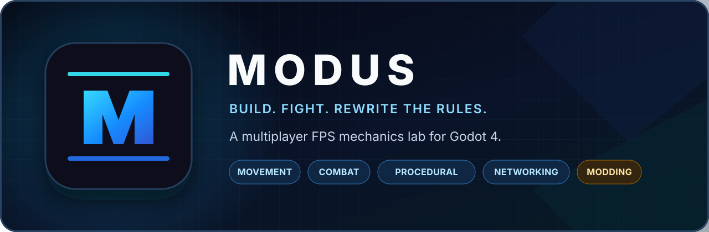
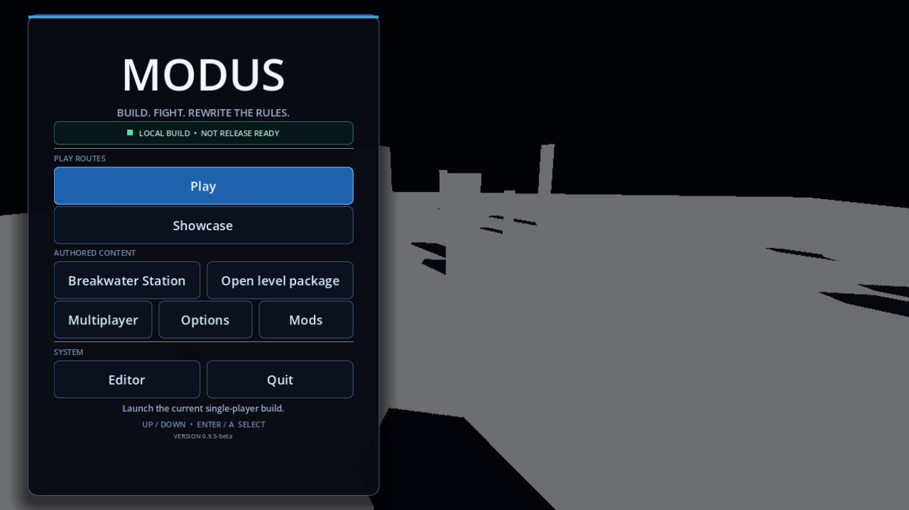
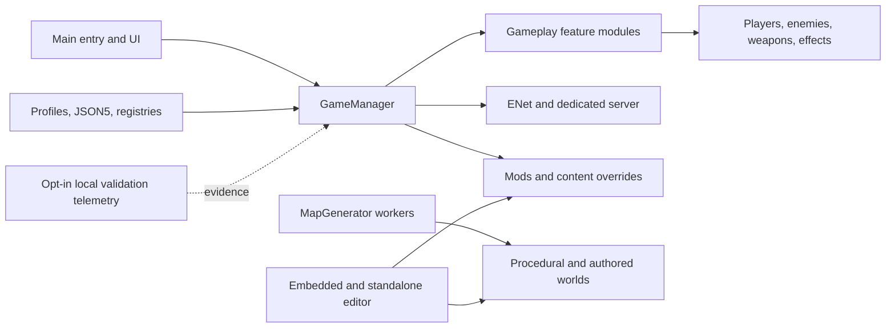

<div align="center">
  

  [](https://github.com/rufl/MODUS/actions/workflows/ci.yml)
  [](https://github.com/rufl/MODUS/releases/tag/v0.9.5-beta)
  [](https://godotengine.org/)
  [](LICENSE)
  [](docs/CURRENT_STATUS.md)

  **Movement, weapons, procedural systems, multiplayer, and modding — built to find out what survives contact with an actual game.**

  [Download beta](#public-beta) · [Quick start](#quick-start) · [Architecture](#architecture) · [Documentation](docs/README.md) · [Contribute](CONTRIBUTING.md)

  [Português do Brasil](README.pt-BR.md)
</div>

> **Documentation status: maintained reference.** This landing page describes the current public repository and beta boundary.


> [!IMPORTANT]
> MODUS is an experimental `0.9.5-beta`, not a finished game or production-ready framework. Public binaries are unsigned. Verified capabilities and open evidence gaps are tracked in [Current Status](docs/CURRENT_STATUS.md).



## Why MODUS exists

FPS mechanics are easy to demo in isolation and hard to keep coherent as networking, content tools, procedural worlds, input methods, and mods begin to interact. MODUS is a working laboratory for those seams.

The repository favors executable systems and explicit evidence over showcase claims. Features are separated into implemented, observed, and still-unproven boundaries so contributors can see both the useful work and the unfinished work.

## What works today

| Area | Implemented surface | Current evidence boundary |
| --- | --- | --- |
| Movement and combat | First-person movement, damage, weapons, projectiles, effects, and configurable gameplay services | Focused automated and showcase-route coverage; balance and broad hardware acceptance remain open |
| Items and encounters | Inventory, pickups, loot tables, enemies, game modes, scores, and timers | Deterministic/unit coverage plus authored demo routes |
| World building | Seeded procedural generation, authored maps, runtime map lifecycle, and content registries | Focused generation and smoke coverage; large-world soak evidence remains limited |
| Multiplayer | ENet host/join paths, dedicated-server code, RPC allowlisting, rate limits, authority validation, and prediction | Local lifecycle and authority observations; representative Internet, hostile-client, and scale testing remain open |
| Creation and mods | Embedded editor, `.mdsl` round trips, JSON/JSON5 data, sample mods, and package validation | Local editor and filesystem flows; public Workshop transfer remains unproven |
| Release engineering | Headless validation, reproducible archives, checksums, and Linux/Windows/macOS beta artifacts | Assets are unsigned and not yet a polished installer experience |

The precise, dated record is in [Current Status](docs/CURRENT_STATUS.md). Known constraints are grouped in the [Known Limits Matrix](docs/KNOWN_LIMITS_MATRIX.md).

## Public beta

The [`v0.9.5-beta` release](https://github.com/rufl/MODUS/releases/tag/v0.9.5-beta) is a reproducible preview for evaluation, not a production release.

| Platform | Download | Notes |
| --- | --- | --- |
| Linux x86-64 | [`tar.gz`](https://github.com/rufl/MODUS/releases/download/v0.9.5-beta/modus-0.9.5-beta-linux-x86_64.tar.gz) | Extract and run `modus.x86_64` |
| Windows x86-64 | [`zip`](https://github.com/rufl/MODUS/releases/download/v0.9.5-beta/modus-0.9.5-beta-windows-x86_64.zip) | Extract and run `modus.exe` |
| macOS universal | [`zip`](https://github.com/rufl/MODUS/releases/download/v0.9.5-beta/modus-0.9.5-beta-macos-universal.zip) | Unsigned and unnotarized application bundle |
| Integrity | [`SHA256SUMS`](https://github.com/rufl/MODUS/releases/download/v0.9.5-beta/SHA256SUMS) | Verify before running an unsigned asset |

```bash
sha256sum --check SHA256SUMS
```

Windows users can verify with `Get-FileHash`; macOS users can use `shasum -a 256`. Compare the result with the published checksum file.

## Quick start

### Requirements

- [Godot 4.7+](https://godotengine.org/download/archive/4.7.2-stable/) — the public beta baseline uses 4.7.2
- Git
- Python 3 and Bash for repository validation tools

```bash
git clone https://github.com/rufl/MODUS.git
cd MODUS
godot --editor --path .
```

Run the project directly:

```bash
godot --path .
```

Check repository contracts without launching a graphical session:

```bash
bash tools/check_project_truth.sh
bash tools/check_documentation_truth.sh
```

The complete aggregate runner is `./tests/runners/run_all_tests_headless.sh`; reserve it for explicit final verification rather than routine focused changes.

Start with [Getting Started](docs/getting_started.md), then use the [Documentation Index](docs/INDEX.md) for gameplay, modding, multiplayer, and contributor references.

## Architecture


```mermaid
flowchart LR
    Entry[Main entry and UI] --> GM[GameManager]
    Config[Profiles, JSON5, registries] --> GM
    GM --> Features[Gameplay feature modules]
    GM --> Network[ENet and dedicated server]
    GM --> Mods[Mods and content overrides]
    Features --> Entities[Players, enemies, weapons, effects]
    Generator[MapGenerator workers] --> World[Procedural and authored worlds]
    Editor[Embedded and standalone editor] --> World
    Editor --> Mods
    Telemetry[Opt-in local validation telemetry] -. evidence .-> GM
```

`GameManager` owns lifecycle, configuration, events, and feature/service registration. `MapGenerator` keeps procedural generation on its own lifecycle. Optional local telemetry records validation evidence only when explicitly enabled and never requires a remote service.

| Path | Responsibility |
| --- | --- |
| `game/scripts/core/` | Lifecycle, configuration, logging, and foundational runtime code |
| `game/scripts/features/` | Optional gameplay and service modules |
| `game/core/network/` | ENet, dedicated-server, authority, and network support |
| `game/entities/` | Players, enemies, components, effects, and projectiles |
| `game/world/` | Authored maps, actors, and test scenes |
| `game/editor/`, `shared/editor_core/` | Embedded/standalone editor data and tools |
| `shared/ui_core/` | Screens, reusable components, and UI managers |
| `game/data/`, `game/config/` | Content registries, schemas, and feature profiles |
| `mods/` | Redistributable sample mods |
| `tests/` | Focused behavior, property, benchmark, and manual-evidence code |

See the [Architecture Reference](docs/architecture.md) and [JSON Schemas](docs/technical/JSON_SCHEMAS.md) for ownership and data contracts.

## Engineering priorities

- **Authority before trust:** RPC allowlists, rate limits, validation, and server-facing ownership are explicit parts of the multiplayer model.
- **Determinism where it matters:** procedural seeds, archive timestamps, and checksums make failures and release artifacts reproducible.
- **Data-oriented extension:** feature profiles, registries, JSON5 configuration, and sample mods keep content changes out of global runtime code.
- **Evidence without inflated claims:** documentation records what was observed, on which boundary, and what still needs representative testing.
- **Tools that exercise the same model:** editor round trips and package validators target the runtime's actual content formats.

Watch the [25-second automated showcase smoke](docs/media/release/golden_demo_smoke_1280x720.mp4), or review the route in [Showcase Route](docs/SHOWCASE_ROUTE.md).

## Current limits

- No signed or notarized desktop binaries.
- No claim of production multiplayer security, Internet-scale reliability, or broad latency tolerance.
- No public Steam Workshop transfer proof.
- Performance evidence is bounded; representative low-end and large-session coverage remains incomplete.
- UI, controller, localization, and accessibility coverage are still expanding.
- APIs and content formats may change before `1.0`.

These are active engineering constraints, not hidden release notes. See the [Roadmap](docs/ROADMAP.md) and [Backlog](./BACKLOG.md) for priorities.

## Contributing

Bug reports, focused mechanics work, documentation corrections, accessibility improvements, and reproducible platform observations are welcome. Read [CONTRIBUTING.md](CONTRIBUTING.md), then use the structured [issue forms](https://github.com/rufl/MODUS/issues/new/choose).

Participation is governed by the [Code of Conduct](CODE_OF_CONDUCT.md). Report vulnerabilities through a [private security advisory](https://github.com/rufl/MODUS/security/advisories/new).

## License and attribution

Code is available under the [MIT License](LICENSE). Third-party art, audio, fonts, and tools retain their own licenses; review [Attribution](docs/ATTRIBUTION.md) before redistributing a build or asset.
