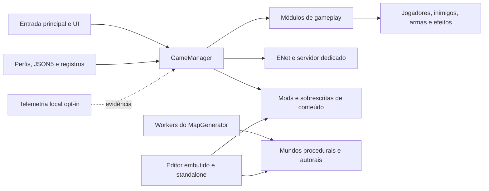

<div align="center">
  

  [](https://github.com/rufl/MODUS/actions/workflows/ci.yml)
  [](https://github.com/rufl/MODUS/releases/tag/v0.9.5-beta)
  [](https://godotengine.org/)
  [](LICENSE)

  **Movimento, armas, sistemas procedurais, rede e mods — construídos para descobrir o que resiste ao contato com um jogo real.**

  [Baixar beta](#beta-público) · [Começar](#início-rápido) · [Arquitetura](#arquitetura) · [Documentação](docs/pt-BR/README.md) · [Contribuir](CONTRIBUTING.md)

  [English](./README.md)
</div>

> **Documentation status: maintained reference.** Esta página descreve o repositório público e a fronteira atual do beta.


> [!IMPORTANT]
> MODUS é um experimento em `0.9.5-beta`, não um jogo finalizado nem um framework pronto para produção. Os binários públicos não são assinados. Capacidades verificadas e lacunas de evidência estão em [Status Atual](docs/pt-BR/CURRENT_STATUS.md).


## Por que MODUS existe

Mecânicas FPS são fáceis de demonstrar isoladamente e difíceis de manter coerentes quando rede, ferramentas de conteúdo, mundos procedurais, diferentes entradas e mods começam a interagir. MODUS é um laboratório executável para essas fronteiras.

O repositório prioriza sistemas funcionais e evidência explícita. A documentação separa o que foi implementado, o que foi observado e o que ainda não foi provado.

## O que funciona hoje

| Área | Superfície implementada | Limite atual da evidência |
| --- | --- | --- |
| Movimento e combate | Movimento em primeira pessoa, dano, armas, projéteis, efeitos e serviços configuráveis | Cobertura automatizada e rota de demonstração; balanceamento e aceitação ampla ainda estão abertos |
| Itens e encontros | Inventário, coletas, tabelas de loot, inimigos, modos, pontuação e cronômetros | Testes determinísticos e rotas autorais |
| Construção de mundo | Geração procedural com semente, mapas autorais e ciclo de vida dos mapas | Cobertura focada; soak de mundos grandes ainda é limitado |
| Multijogador | Hospedagem/entrada ENet, servidor dedicado, allowlist de RPC, limites de taxa, autoridade e predição | Observações locais de ciclo de vida e autoridade; Internet, clientes hostis e escala continuam abertos |
| Criação e mods | Editor embutido, round trip `.mdsl`, dados JSON/JSON5, mods de exemplo e validação de pacotes | Fluxos locais; transferência pública pelo Workshop ainda não foi provada |
| Entrega | Validação headless, arquivos reprodutíveis, checksums e artefatos beta para Linux/Windows/macOS | Artefatos sem assinatura e sem instaladores polidos |

O registro datado está em [Status Atual](docs/pt-BR/CURRENT_STATUS.md). Restrições conhecidas estão na [Matriz de Limites](docs/KNOWN_LIMITS_MATRIX.md).

## Beta público

A versão [`v0.9.5-beta`](https://github.com/rufl/MODUS/releases/tag/v0.9.5-beta) é uma prévia reprodutível para avaliação.

| Plataforma | Download | Observação |
| --- | --- | --- |
| Linux x86-64 | [`tar.gz`](https://github.com/rufl/MODUS/releases/download/v0.9.5-beta/modus-0.9.5-beta-linux-x86_64.tar.gz) | Extraia e execute `modus.x86_64` |
| Windows x86-64 | [`zip`](https://github.com/rufl/MODUS/releases/download/v0.9.5-beta/modus-0.9.5-beta-windows-x86_64.zip) | Extraia e execute `modus.exe` |
| macOS universal | [`zip`](https://github.com/rufl/MODUS/releases/download/v0.9.5-beta/modus-0.9.5-beta-macos-universal.zip) | Aplicativo sem assinatura e sem notarização |
| Integridade | [`SHA256SUMS`](https://github.com/rufl/MODUS/releases/download/v0.9.5-beta/SHA256SUMS) | Verifique antes de executar |

```bash
sha256sum --check SHA256SUMS
```

## Início rápido

Requisitos: [Godot 4.7.2](https://godotengine.org/download/archive/4.7.2-stable/), Git, Python 3 e Bash para as ferramentas de validação.

```bash
git clone https://github.com/rufl/MODUS.git
cd MODUS
godot --editor --path .
```

Para executar diretamente e verificar os contratos do repositório:

```bash
godot --path .
bash tools/check_project_truth.sh
bash tools/check_documentation_truth.sh
```

Consulte [Primeiros Passos](docs/getting_started.md) e o [Índice em português](docs/pt-BR/README.md).

## Arquitetura



`GameManager` coordena ciclo de vida, configuração, eventos e registro de serviços. `MapGenerator` mantém a geração procedural em um ciclo separado. A telemetria local opcional só registra evidência quando habilitada explicitamente e não depende de serviço remoto.

Veja a [Referência de Arquitetura](docs/architecture.md) e os [Schemas JSON](docs/technical/JSON_SCHEMAS.md).

## Prioridades de engenharia

- **Autoridade antes de confiança:** allowlists, limites, validação e propriedade no lado do servidor são explícitos.
- **Determinismo:** sementes procedurais, timestamps de pacotes e checksums tornam falhas e artefatos reproduzíveis.
- **Extensão orientada a dados:** perfis, registros, JSON5 e mods de exemplo evitam novo estado global.
- **Evidência sem promessas infladas:** cada afirmação registra o limite observado e o que ainda exige testes representativos.
- **Ferramentas no formato real:** round trips do editor e validadores exercitam os mesmos dados usados pelo runtime.

Assista ao [smoke automatizado de 25 segundos](docs/media/release/golden_demo_smoke_1280x720.mp4) ou veja a [Rota de Demonstração](docs/SHOWCASE_ROUTE.md).

## Limites atuais

- Binários desktop sem assinatura ou notarização.
- Sem alegação de segurança em produção, confiabilidade em escala de Internet ou tolerância ampla a latência.
- Sem prova de transferência pública pelo Steam Workshop.
- Evidência limitada para hardware de entrada e sessões grandes.
- Cobertura de interface, controles, localização e acessibilidade ainda em expansão.
- APIs e formatos de conteúdo podem mudar antes de `1.0`.

Veja o [Roadmap](docs/ROADMAP.md) e o [Backlog](./BACKLOG.md).

## Contribuição, segurança e licença

Relatos reproduzíveis, mecânicas focadas, correções de documentação e melhorias de acessibilidade são bem-vindos. Leia [CONTRIBUTING.md](CONTRIBUTING.md) e o [Código de Conduta](CODE_OF_CONDUCT.md). Vulnerabilidades devem ser enviadas por um [aviso de segurança privado](https://github.com/rufl/MODUS/security/advisories/new).

O código usa a [Licença MIT](LICENSE). Arte, áudio, fontes e ferramentas de terceiros mantêm suas próprias licenças; consulte [Atribuição](docs/ATTRIBUTION.md) antes de redistribuir uma build ou asset.
