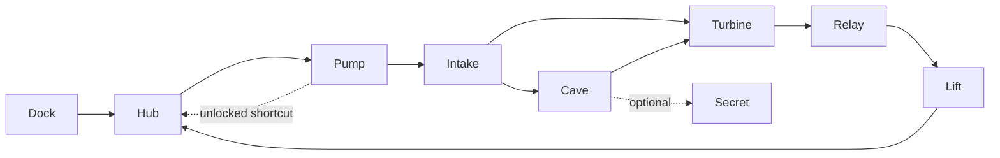

# MODUS Release and World-Building Plan

> **Documentation status: maintained reference.** Research, selected decisions and delivery evidence are separated below. Generator correctness and the three-room module/editor implementation are exercised; full mission production, graphical acceptance and release gates remain distinct.

**Research date:** September 13, 2026  
**Current readiness:** **NOT READY**  
**Status authority:** [Current Status](CURRENT_STATUS.md), [Known Limits](KNOWN_LIMITS_MATRIX.md), and [active backlog](../BACKLOG.md).

## Decision Summary

Build one shared world-authoring system: **authored modules + mission graphs + constrained spatial assembly + editable results**. Use it for a carefully composed first mission, seeded expeditions, and persistent hubs. Extend the current generator, editor, mission service, save system, and `.mdsl` packager rather than introducing a competing engine or file format.

The quality target is a compact, polished FPS mission with readable combat, deliberate pacing, environmental storytelling, dependable traversal, and strong audio/visual feedback. More rooms, more random decoration, or more post-processing do not establish that quality. “Better than Obsidian” needs comparative playtesting; “AAA” is an aspiration, not an evidence label.

Treat shipping separately from world design. Installer/release automation can advance without Steam publication; Steam/Workshop approval and genuine WAN/Windows observations cannot be produced by local simulations.

## Research: What to Borrow and What Not to Claim

| Reference | Evidence | Decision for MODUS |
| --- | --- | --- |
| [Active Obsidian continuation](https://github.com/GTD-Carthage/Obsidian-Content) | The old Obsidian repository explicitly redirects here. Its [level pipeline](https://github.com/GTD-Carthage/Obsidian-Content/blob/master/scripts/level.lua) separates rooms, quests, construction, battles, and pickups; configuration can be recovered from generated output. | Separate topology/progression from spatial construction and population; preserve seed, configuration, generator version, and content identity. Do not dismiss its mature content library or compare engines as if they were generators. |
| [DOOM SnapMap official reference](https://snapmaps.idsoftware.com/) | Blueprint Mode connects modules; Object Mode places objects and gameplay logic. The reference also documents network/object/memory budgets and navigation limitations. | Shared sockets, visual logic, instant playtest, visible resource budgets, and explicit invalid-connection feedback. Inspiration only: no copying DOOM modules, textures, sounds, or proprietary code. |
| [Dead Cells lead-designer explanation](https://deepnight.net/tutorial/the-level-design-of-dead-cells-a-hybrid-approach/) | Authored world structure, biome-specific room chunks, concept graphs, constrained room selection, and encounter rules. | Author important moments and generate their arrangement. Fix the first mission's story and reveal sequence; vary expeditions within authored constraints. |
| [Valve: The AI Systems of Left 4 Dead](https://cdn.akamai.steamstatic.com/apps/valve/2009/ai_systems_of_l4d_mike_booth.pdf) | Dramatic peaks and recovery; the director modulates pacing rather than quietly changing difficulty. | Alternate exploration, pressure, peak, and recovery. Begin with authored encounter budgets; do not add a reactive director before encounters are good on their own. |
| [Dormans: Adventures in Level Design (2010)](https://pcgworkshop.com/archive/dormans2010adventures.pdf) | Separates the mission dependency graph from physical space; a geometric connection can accidentally bypass the mission. Grammar quality still depends on designers. | Validate objectives and traversal state before spatial assembly, then validate the realized route again. A connected map is not necessarily a valid mission. |
| [Ludomotion: Level Generation in Unexplored 2](https://www.ludomotion.com/blogs/level-generation/) | Uses successive graph/tile representations, directional gates, locks and one-way valves; final visual layers realize the gameplay representation. | Design meaningful cycles, detours and return shortcuts. Keep topology, geometry and presentation separate but linked by stable IDs. Do not copy its game-specific grammars. |
| [WaveFunctionCollapse](https://github.com/mxgmn/WaveFunctionCollapse) | Local adjacency constraints; contradictions are possible; easy tilesets do not automatically produce interesting global arrangements. | Optional local material/detail infill later. Do not use unconstrained WFC as proof of mission solvability, pacing, or global navigation. |
| [Godot CSG guidance](https://docs.godotengine.org/en/stable/tutorials/3d/csg_tools.html) | CSG is primarily for prototyping; baking meshes/collision enables faster loading and supports lightmapping/occlusion workflows. | Keep editable greyboxes, but package baked module geometry, collision, and validated navigation. Avoid thousands of live CSG operations in the showcase. |

These sources were read, not benchmarked against MODUS. No comparative quality/performance result is claimed. Obsidian's source is GPL-family and its content includes mixed licenses; study the approach without importing code/assets into MODUS's MIT distribution without a separate rights review. UZDoom compatibility/export is not implied by a native Godot generator.

**Follow-up research boundary:** the official SnapMap homepage was readable, but its linked Blueprint/Object Mode pages returned HTTP 404, including a trailing-slash retry. The two-workspace recommendation is supported by the homepage; no inaccessible manual details are claimed. The Unexplored article describes its authors' system, not a measured advantage over MODUS. These comparisons concern generation and authoring approaches, not a claim that Godot is intrinsically better than Doom/UZDoom.

## Current Source Audit

| Area | Current implementation and gap | Integration owner |
| --- | --- | --- |
| Generator orchestration | Data phases run before scene phases. Rule loader/pipeline objects are constructed, but the live orchestrator does not invoke their rule execution. | `game/scripts/map_generator/map_generator.gd`, `rule_execution_pipeline.gd` |
| Determinism | Revision 2 uses context-owned gameplay RNG and a separately seeded cosmetic stream; focused global-RNG interference and complete saved-scene replay regressions pass. Same-seed output differs from the old generator. | `generation_context.gd`, generation components and `tests/unit/test_map_generator_seed_rng.gd` |
| Progression | Key/door/secret/item records now survive packing; deterministic key-lock generation also publishes versioned objective, lock and recovery-route metadata, rejects impossible placements transactionally and is validated/retained by `MissionMgr`. Runtime pickup/door actor realization and a composed procedural mission graph remain separate. | `generation_context.gd`, `map_generator.gd`, `key_lock_system.gd`, `mission_manager.gd`, `validation_system.gd` |
| Module assembly | Canonical `PrefabMetadata` now includes typed sockets, opening/clearance volumes, dimensions, revision and capabilities. `ModuleAssembly` validates transactional placement; the editor library retains that same definition. Automatic generator mission-graph assembly remains separate. | `prefab_metadata.gd`, `shared/editor_core/core/module_assembly.gd`, both prefab libraries |
| Navigation | Revision 2 prepares geometry in a private viewport, bakes CPU collision geometry and validates real routes on isolated synchronous maps before packing. Saved-scene paths and floor collision pass. | `map_generator.gd`, `navigation_mesh_baker.gd`, `validation_system.gd` |
| Voxel cave integration | `CaveSystemGenerator` constructs/detects a voxel helper but the cave phase does not call it. | `game/scripts/map_generator/cave_system_generator.gd`, `voxel_cave_generator.gd` |
| First level | `game/levels/breakwater_gate.tscn` contains three authored functional rooms and original baked geometry. The Systems Lab remains separate; the larger composed mission and reviewed audiovisual route remain in production scope. | `game/levels/modules/breakwater/`, `game/levels/level_play_session.gd` |
| Missions and hubs | Persistent authored sessions now stage and validate destinations before coordinated commit, retain players/transport and restore visited actor/objective state through encrypted campaign saves. Three-process ENet travel, refusal, late join and preparation-disconnect proof passes. | `mission_manager.gd`, `game_state_manager.gd`, `level_play_session.gd`, `level_destination.gd`, `level_travel_network.gd`, `level_runtime_state.gd` |
| Editor roundtrip | Document replacement preserves root state/names, nested ownership and collision; history changes only after successful replacement. Source and exported Linux editor → package → game headless workflows pass with document-owned channels. | `embedded_level_editor.gd`, `level_root.gd`, `channel_system.gd`; [dated proof](EDITOR_ROUNDTRIP_PROOF.md) |
| Releases | Five export presets include Linux client/server/editor and Windows client/editor. Portable schema-v1 manifests now generate and verify role-associated executable/PCK hashes and commit/runtime identity; candidate staging verifies before/after copying. Linux package upgrades preserve unowned files and roll back failure. September 22 focused regressions and a retained Linux client lifecycle pass; CI candidate assembly has local syntax proof only. Native dependency lock, signing/authentication, public release and target-Windows proof remain open. | `export_presets.cfg`, `.github/workflows/ci.yml`, `tools/validate_release_artifacts.py`, `tools/stage_release_artifacts.py`, `tools/package_linux_portable.sh` |
| Steam | Steam singleton and `SteamMultiplayerPeer` are separate runtime requirements. Dedicated server calls `init_game_server(...)`, but the manager exposes `initialize_steam_server(Dictionary) -> void`; this is not a safe one-line rename. | `game/core/network/dedicated_server.gd:411-443`, `game/core/network/steam_manager.gd:94-138,496-580` |
| Workshop | Real upload does not retain the created PublishedFileId through its pending update record; download starts without an installation-completion contract. Subscription, download and installed availability must be separate states. Filesystem simulation remains separate evidence. | `shared/editor_core/data/workshop_manager.gd`: `_steam_upload`, `_on_ugc_item_created`, `_on_ugc_item_updated`, `_steam_download`, `subscribe` |

### Reproduced defect before repair

On September 13, stock Godot `4.7.2.stable.arch_linux.ed1daf0bf` ran copies of the eight relevant generator/data scripts in a disposable no-autoload, headless project. No game scene, display, Steam client, or network service was used.

Fixture: 32×32 grid, four linked 3×3 rooms centered at `(5 + 6i, 12)`, one entrance per room, context RNG seed `424242`. Call the public key-lock and secret generation methods four times, with a fresh identical context each time. Repeat with global RNG seeds `111` and `999`.

Observed key positions:

- Global `111`: `(7,14)`, `(5,14)`, `(5,14)`, `(6,14)`.
- Global `999`: `(5,14)`, `(5,14)`, `(7,13)`, `(6,14)`.
- First secret entrance also changed: `(9,13)` versus `(12,10)`; generated secret cells differed.
- Probe completed with exit `0` and no stderr. `keys_equal=false`, `secrets_equal=false` report the reproduced defect, not passing determinism.

This bounded pre-fix experiment invalidated the earlier unconditional same-seed/same-content claim. Historical RNG-unit counts were not a rebuttal; the implementation and proof below supersede this defect's current status.

### Generator correctness delivery

**September 13, generator revision 2, Godot `4.7.2.stable.arch_linux.ed1daf0bf`: 55/55 focused tests, 1,319 assertions across nine scripts.** Separate 64×64 and default 128×128 source-generation smokes at seed `generator-correctness` complete. The 128×128 output contains 1,405 navigation polygons, 27 rooms, 28 hallways, one outdoor area, one cave area, one secret, 81 monster records and 23 item records. This is an automated geometry/data contract, not a finished mission or a cross-platform benchmark.

**September 22 capability/progression slice:** `FeatureAvailability` is now the canonical versioned runtime contract. Generated/authored descriptors include runtime identity, required capabilities and explicit fallback policy; staged destinations and travel admission validate the manifest before loading or spawning peers, rejecting missing Voxel Tools instead of silently downgrading. The key-lock pipeline publishes deterministic key/door/objective/recovery records only after structural validation, and `MissionMgr` validates generated metadata before installing document mission state. Focused capability/prefab/mission proof passes 43/43 with 299 assertions; deterministic generator proof passes 6/6 with 191 assertions. This does not prove the bundled native runtime, graphical review, generated actor realization or full mission production.

- All generation randomness uses the context RNG; cosmetic batching/theme randomness uses a separately seeded stream. The effective seed argument is preserved without mutating the caller's configuration.
- Room polygons and gameplay positions share 2-metre cell-center coordinates. Hallways connect components rather than treating two disconnected pairs as a connected graph. A separate before/after fixture changed from 2/4 reachable rooms to 4/4. Organic-region growth preserves existing rooms/hallways and connects its retained footprint.
- Secret footprints and entrances are reserved before geometry; rewards occupy actual cells. Successful key/door pairs and all secret/item records survive in `GeneratedMap`'s `generation` metadata. `spawn_player` and `enemy_spawn` markers and theme lighting are packed.
- Navigation uses prepared CSG CPU collision faces and prefab static collision, not polygon-count coverage estimates or GPU readback. Validation uses private map/region RIDs with synchronous iterations and rejects missing paths, disconnected required rooms/spawns, orphan doors, lost key records and circular key dependencies.
- The 64×64 regression saves/reloads the actual generated scene, queries routes to rooms/keys/monsters and raycasts the player floor. Global seeds `111`/`999` preserve gameplay records and baked navigation vertices. Cancellation after CSG preparation cannot abort a new generation.

Focused selection, using the private runtime-directory setup described in [Test Runners](../tests/runners/README.md#single-file-gut-selection):

```bash
godot --headless --path . -s addons/gut/gut_cmdln.gd -gconfig= \
  -gtest=res://tests/unit/test_map_generator_seed_rng.gd \
  -gtest=res://tests/unit/map_generator/test_shape_grammar_engine.gd \
  -gtest=res://tests/unit/map_generator/test_hallway_generation.gd \
  -gtest=res://tests/unit/map_generator/test_key_lock_system.gd \
  -gtest=res://tests/unit/map_generator/test_cellular_automata_engine.gd \
  -gtest=res://tests/unit/map_generator/test_validation_system.gd \
  -gtest=res://game/scripts/map_generator/tests/test_navigation_mesh_baker.gd \
  -gtest=res://game/scripts/map_generator/tests/test_multimesh_manager.gd \
  -gtest=res://tests/unit/test_map_generator_threading.gd -gexit
```

Source-controlled resource references are checked independently of Godot's generated `.godot` import cache:

```bash
tools/validate_asset_integrity.py --root .
```

The gate scans authored `path=` and `preload` references under runtime roots, excludes fixture-only test resources, and never treats generated imports as release evidence.

**Compatibility and exclusions:** revision 2 intentionally changes old seed-to-content output; replay must pin runtime, generator and content. Existing saved geometry is not automatically regenerated. Key/door/reward records and the grid solver do not implement collision-blocking door actors, pickup collection or objectives. There was no visual/manual playthrough, full test matrix, native voxel path, rule/module assembly, exported-editor, WAN, Steam/Workshop or target-Windows proof in this delivery. The remaining program below is still open.

### Editor persistence reproduction

The renewed research exercised `EmbeddedLevelEditor.save_level` and `load_level` on Godot `4.7.2.stable.arch_linux.ed1daf0bf`. Fixture: a root, an authored room, its static wall and a box collision shape, with root-owned descendants and a saved root metadata value. Save, mutate the metadata, load, then save again and instantiate the second file.

| Observed property | Result |
| --- | --- |
| Nodes in the first saved scene | 4 |
| Collision child visible immediately after load | Yes |
| Authored room still owned by the level root | No |
| Nodes in the second saved scene | 1 |
| Collision survives the second saved scene | No |
| Saved root metadata restored | No; unsaved value remains |

The original source API invocation produced these results but also reported `Identifier "sync_cursor" not declared in the current scope` in `editor_network_adapter.gd:359` while compiling dependencies. A second disposable, no-autoload headless project ran exact copies of the two persistence methods and reproduced the same results independently. It emitted the detached-global-transform error and inconsistent-owner warning from child reparenting. Both probes exited `0`; **that exit code records completed defect reproduction, not a passing editor**. Neither exercised a graphical or exported editor.

Pre-fix root cause: `load_level` kept the old root, reparented only children and freed the loaded root, dropping root state and packing ownership. The implemented replacement now stages validation before committing the entire loaded root, preserves nested ownership/transforms, rebinds editor services and clears selection/history only on success. It detaches the previous root before attachment so repeated opens preserve the saved root name.

The channel mismatch is also repaired: `LevelRoot` constructs its runtime-only `ChannelSystem` before descendant actor readiness. Stable module/actor identities, channel settings and the original gameplay instigator survive serialization and relocation. The historical `LevelSaveSystem` proof did not cover these defects; current regressions and actual workflow observations are recorded in [Editor Round-Trip Proof](EDITOR_ROUNDTRIP_PROOF.md).

### Three-room implementation and exercised behavior

Source and exported Linux standalone editors place airlock, pump hall and control room through the Modules UI, connect `pump/power_switch` to `control/security_door` through Gameplay mode, and exercise undo/redo. They save, reopen, resave, play through the actual `Player` and return to unchanged author data before `.mdsl` export/extraction. The exported Linux game opens the editor-produced package through its normal `-- --level` entry and completes the same gameplay/checkpoint/navigation checks.

- A maintenance key is collected once; the keyed switch opens a physically blocking animated door; the final terminal requires the earlier objectives.
- Existing encrypted checkpoints restore pre-gate, powered and completed state without replaying activation. JSON numeric representation does not invalidate legitimate saves.
- Collision-backed navigation connects all three rooms and the upper pump walkway. Moving door leaves do not permanently carve the baked floor.
- The room document retains 23 meshes/24,764 vertices, three architectural collision shapes, four actors and one player spawn. OBJ imports become native mesh resources for package playback without an editor importer; package-local paths cannot resolve back through host resource UIDs.
- Focused editor/history proof: 36/36 tests, 204 assertions. Module/navigation proof: 25/25, 105 assertions. These are not a refreshed aggregate suite.

The [dated round-trip proof](EDITOR_ROUNDTRIP_PROOF.md) records native artifact evidence and pressure-blocked graphical verification. Automated headless actions do not establish rendered appearance, keyboard/pointer feel, finished audiovisual quality or the larger mission's acceptance.

## First Mission: Breakwater Station — Black Start

**Proposed art direction:** a storm-damaged tidal power station built into sea cliffs. Salt-stained pale concrete, dark steel, restrained teal equipment, warm amber emergency power, wet exterior surfaces, and a distinct relay-tower silhouette. Original industrial architecture rather than borrowed DOOM imagery. A repeated light/power motif visibly changes as systems come online.

**Player objective:** restore station power, reach the relay, then return to the now-operational hub. Target a 15–20 minute first playthrough with two optional secrets. Duration is a design hypothesis to test, not measured content.

| Space | Intended moment | Engine features exercised |
| --- | --- | --- |
| Arrival / service dock | Sheltered spawn, quiet exterior reveal, clear first destination | Spawn, HUD, input, weather, environmental audio, settings |
| Anchorage hub | Safe equipment bench, mission selection, locked return shortcut; relay tower visible | Inventory, equipment, loot, save/load; later travel and session persistence |
| Pump hall | First readable fight with cover and a flanking loop; restore auxiliary power | Weapons, enemies, navigation, damage, pickups, switch/door logic |
| Intake galleries | Hazard timing and low-pressure traversal after combat | Jump pad, lift/platform, climbing route, hazard damage and recovery |
| Flooded service cavern | Quieter exploration and optional breakable-wall secret | Cave geometry, lighting, secrets, rewards; voxel editing only in the supported voxel profile |
| Turbine atrium | Multi-level encounter; lower loop, upper bridge and escape route; coolant objective changes machinery | Multiple combat roles, projectiles, interactive geometry, objective/channel state |
| Relay crown | Short, authored climax framed against the coast, not an oversized random boss box | Bounded waves, ammo/health economy, completion and effects |
| Return lift / hub | Shortcut into recognizable space; power and lighting confirm the outcome | Checkpoint restoration, persistent completion, return travel, next expedition |



The mandatory route must work with the default movement kit. Advanced movement earns shortcuts/rewards rather than becoming an undocumented hard gate. Hazards need recoverable failure, readable timing and a safe restart; never teleport a failed player to an arbitrary world origin. Doors/waves must not softlock after saving, dying, loading or reconnecting.

Do not force every engine subsystem into the story. Keep the current labs as a separate **Systems Lab** destination; use the mission for coherent gameplay, the hub for inventory/editor/mod workflows, and explicit multiplayer scenarios for revive, splitscreen, authority and late join. Maintain a feature-to-scenario coverage table so “all features” has an auditable meaning.

### Content and presentation production

1. Greybox the complete route with the actual player capsule, speeds, slopes, jump envelope and enemy navigation dimensions; those measurements determine sockets and clearances.
2. Produce one finished **pump-hall module** as the visual quality reference: geometry, trim/material discipline, collision, lighting, sound, one good encounter, and readable routes. Review in motion before multiplying it.
3. Build a reusable initial kit: hub, airlock, straight connector, elbow, junction, stairs/lift shaft, pump room, traversal gallery, cave connector, turbine arena, secret chamber, relay/exit room. Larger landmarks may contain several modules.
4. Provide deliberate silhouette, foreground/midground/background depth, material roughness variation, restrained decals and sound zoning. Do not obscure enemies with excessive fog, bloom, particles or screen effects.
5. Bake static geometry/collision and validate seams. Reuse mesh/material resources and existing MultiMesh/LOD/occlusion support where measured useful; do not batch interactive actors into decorative-only instances.
6. Source or author cleared hero props, trim materials, enemy/weapon presentation, ambience and combat sounds. Current prototype art is not a substitute for this production step. Add every distributed asset/dependency to the existing provenance/notices workflow.
7. Preserve reduced motion/flashes, legible HUD, non-color-only navigation cues, remappable input and controller focus. Capture the real renderer and named hardware; do not pass off a render mockup as gameplay.

### Mission direction and quality reference

**Proposed creative rule: power changes the place.** On arrival the relay is a dark silhouette; restoring auxiliary power lights a visible route, restarting cooling animates the turbine hall, and transmitting at the crown brings the hub back to life. Make those changes visible from previously visited viewpoints. Three intentional reveals beat a larger collection of disconnected spectacle rooms.

| Beat | Intended treatment | Exit condition |
| --- | --- | --- |
| Dock and hub | Wind/rain outside, sheltered readable interior, relay in sight; introduce equipment without interrupting movement | Player identifies the pump-hall destination without a debug marker |
| Pump hall | First complete combat loop: central machinery blocks a straight firing lane; side aisles permit repositioning; visible balcony foreshadows return | Activate auxiliary power; unlock a recognizable hub shortcut |
| Intake and cavern | Lower pressure; a safe example teaches the hazard before the timed crossing; optional cavern rewards exploration | Reach cooling controls without requiring an advanced movement unlock |
| Turbine atrium | Lower circulation loop, upper bridge and protected recovery space; combine previously introduced threats instead of spawning every enemy type | Restore cooling and complete a bounded encounter |
| Relay crown | Short climax against the coast, telegraphed reinforcements, supplies available before commitment | Transmit, release the return lift, persist completion |
| Hub return | Same room, changed lighting/sound/machinery, completed objective visible | Save/revisit preserves the result and allows expedition selection |

The existing 15–20 minute goal remains a playtesting target. Encounter durations, enemy counts and ammunition are tuned with the actual weapons/player and recorded difficulty, not taken from the current random spawn count.

**Pump-hall production reference:** begin with a provisional 28 × 24 metre footprint, a 4-metre raised walkway and a readable 4-metre-wide connector opening on the existing 2-metre generation grid. These are greybox hypotheses, not approved collision metrics. Provide stairs/lift for the required upper route, a full lower flanking loop, reserved door approaches and no mandatory blind drop. Validate the largest permitted enemy as well as the player at each opening. Movement source defaults are 7 m/s movement, 5.5 jump velocity and a 30-degree walkable-slope setting, but configuration overrides speed/jump; freeze and measure the shipped movement profile before approving dimensions.

Finish this one room in motion before producing variants: trim-sheet/material consistency, deliberate roughness, original machinery silhouette, layered ambience, spatially legible combat sounds, readable hit feedback, stable exposure and clean collision seams. Keep combat silhouettes clear of fog and busy backgrounds. Bake static module geometry; retain interactables as separate actors. Review low/reduced-effects settings and controller navigation, not only a chosen screenshot.

### Production candidate and acceptance boundary

The September 13 production pass applies the pump-hall palette/detail discipline to all eleven modules: sheltered coastal arrival, hub service equipment, intake conductors/refuges, faceted cavern/water, cylindrical turbine machinery, a distinct relay crown and an articulated return bridge/lift. Static collision remains baked; turbine casing collision matches its cylinder mesh.

Three power stages drive steady lighting, emissive fixtures, machinery and ambience without replaying gameplay on restoration. Six original synthesized loops feed thirteen finite spatial zones. Reduced motion freezes decorative rotors/rain; low or zero-particle settings disable rain. Authored signs supplement color, and the generated-map minimap is hidden for mission documents.

The current authored economy has thirteen enemies across pump, turbine and relay encounters, with recovery supplies before commitment and no regenerating mission crates. Reserve pickups no longer refill magazines or every weapon. Real-weapon native completion proves the route is feasible with finite resources; it does not establish first-play difficulty or the 15–20 minute target. No artificial delays were added to manufacture that duration.

The local Linux client completes the packaged mission, including obstructed-lift recovery, mid-ride and completed-state checkpoints. Isolated native rendering covers fourteen views/all eleven rooms, with measured spatial audio, mute, restored-power and reduced-effects checks. See [Current Status](CURRENT_STATUS.md) for exact results and the [human production checklist](../tests/docs/MANUAL_TEST_TIMING.md#black-start-production-acceptance) for the remaining gate. Human-operated completion, listening/visual approval and pacing remain open; this candidate is not release approval.

### Feature-to-scenario coverage

This is a **planned coverage assignment**, not proof that these combinations work. Each row needs an observed gameplay result and state restoration where applicable; update the table when the supported feature inventory changes.

| Existing feature family / actor types | Intended mission use | Separate exhaustive scenario |
| --- | --- | --- |
| Movement, jump, crouch, advanced movement | Main traversal uses the default kit; optional ledges reward advanced movement | Movement/traversal labs cover remaining modes, slopes and recovery |
| `switch`, `counter`, `timer`, `trigger_zone`, `door` | Power controls, bounded encounter release and return shortcut | Systems Lab covers input modes, delayed/repeated triggers, invalid connections |
| `platform`, `jump_pad`, `teleporter` | Intake lift and optional jump-pad route; hub expedition departure | Traversal lab covers moving-platform edge cases and teleport recovery |
| `hazard_volume`, `spike`, `collapsable_floor` | Readable steam/electrical hazard and recoverable service-gallery collapse | Systems Lab covers every damage/timing variant; no forced spike trap in industrial art |
| `enemy_spawner`, `pickup_spawner`, combat and loot | Authored encounter roles, supplies before gates, rewards after pressure | Combat/loot labs cover all weapons, enemies, status effects and equipment |
| `secret_wall`, `glass_pane`, `wood_crate`, `barrel` | Two cued secrets, breakable observation glass, supplies and a deliberately placed explosive | Systems Lab covers all breakable/material variants and reset behavior |
| `fog_zone`, `environment_volume`, lighting/audio/weather | Exterior/interior transitions and visible power-state changes | Environment lab covers every supported setting and reduced-effects profile |
| Inventory, skills, save/load and objectives | Hub equipment and checkpoints before/after every progression gate | Restoration scenarios cover death, reload, missing content and duplicate reward prevention |
| Voxel edits | Bounded optional service-cavern dig/build experiment in the required native profile | Terrain scenario covers save/reload, collision/nav rebuild, authority and late join |
| Co-op, revive, splitscreen, networking | Named co-op route variant where designed and proven | Separate multi-client, local-input and WAN scenarios; solo completion proves none of these |
| Editor, mods and Workshop | Hub access to authoring and local package selection | Exported-editor and real Workshop lifecycle gates below |

Do not turn the first mission into a switch museum to satisfy coverage. The hub connects the composed mission, generated expeditions and Systems Lab; the coverage table makes the whole showcase auditable without damaging the main route.

## Shared Generation and Authoring Architecture

### One content contract

Extend `PrefabMetadata` into the common generator/editor module contract, keeping existing prop placement distinct from room assembly. Use Godot `PackedScene` assets and the established serialization/`.mdsl` pipeline. Migrate checked-in metadata and every caller when changing the schema; do not leave two competing socket formats.

Required module data:

- Stable module ID, schema/content revision, scene dependency list, bounds and reserved volumes.
- Typed socket IDs with local transform, opening width/height, floor elevation, approach/clearance volume, traversal capability and supported orientation. Position-only anchors are insufficient.
- Role/theme tags, compatible neighbors, allowed rotations and authored variants; no arbitrary mirroring/scaling unless validated for collision, art and gameplay.
- Traversal links and navigation data, safe player/enemy spawn anchors, encounter/cover lanes, secrets and rewards.
- Stable actor IDs and named logic ports. Cross-module connections use instance ID + actor ID, not transient object IDs or fragile absolute NodePaths.
- Declared required capabilities: voxel editing, supported traversal, gameplay/network mode. Resolve them before loading a map.
- Resource budgets and provenance references. Embedded and standalone editors consume the same data as the generator.

Extend `GenerationContext` with the mission graph, explicit gate/key/objective records, selected module instances, socket pairings and canonical generated-content manifest. Preserve existing grid/cell generation for terrain and local infill; do not treat a 2D room grid as the whole vertical world model.

### Generation stages

1. **Mission plan:** choose an authored graph template with spawn, goal, mandatory objectives, optional branches, loops, difficulty and recovery beats. Reuse `MissionMgr` for execution; extend it beyond elimination objectives instead of introducing a second objective service.
2. **Progression validation:** search states `(room, acquired keys, completed objectives, movement capabilities)`; prove the goal reachable, each mandatory prerequisite obtainable, and no key behind its own gate. Check one-way links and route changes explicitly.
3. **Module selection:** deterministic weighted choices from compatible authored modules; preserve fixed landmarks and designer-pinned rooms; penalize recent repeats.
4. **Spatial solve:** place required modules first with typed socket matching, occupancy/clearance tests, bounded backtracking and stable candidate ordering. Failed constraints report the offending room/socket; never silently publish a partial map.
5. **Terrain and connectors:** fill the planned gaps, preserve approach volumes, and connect exterior/cave segments to verified module entrances. Decorative generation cannot change the mandatory route.
6. **Encounter and economy pass:** threat roles, sightlines, encounter/recovery rhythm, resource access before gated fights, and predictable difficulty settings. Client count can select a declared encounter profile; it must not silently alter base geometry.
7. **Presentation:** authored lighting/audio zones, optional deterministic prop variants, decals and non-blocking detail. Keep gameplay and cosmetic RNG streams separate so adding a prop does not move a key.
8. **Bake and runtime validation:** instantiate the actual result, build/load collision and navigation, synchronize the navigation server, and query every required spawn/objective/exit route. A nonempty nav resource or area percentage is insufficient.
9. **Package:** write seed, generator revision, config, content hashes, module transforms, objective graph and dependencies into the existing level package. Preserve a generated result even if a future generator version changes. Clients validate the host's canonical manifest rather than assuming seed-only reproduction across engine versions.

For the first mission, use fixed authored placement through this same contract. For expeditions, vary graph templates, room choices, routes, hazards and encounters while preserving landmarks and feasibility. The editor can pin rooms and regenerate only unlocked sections; invalid boundary sockets prevent partial regeneration from committing.

### Deliberate variation and solver contract

Start with a small authored grammar vocabulary: **visible locked shortcut → detour → unlock**, **two differently pressured routes → reunion**, **one-way descent → alternate return**, **objective → changed space → revisit**, and **optional challenge → optional reward**. Not every seed must use every pattern. A visual variant of one room is not a new topology; record both module reuse and graph-pattern reuse.

The logical state is `(location, acquired keys, completed objectives, traversal capabilities, relevant gate/world state)`. Prove the goal and recovery routes in that state space, including one-way edges and save/death/rejoin transitions. Dominance pruning is valid only for monotonic flags; toggles and consumable keys cannot be treated as permanently acquired powers. Optional terrain destruction must not bypass a mandatory gate unless the mission explicitly permits that solution.

For spatial assembly, place fixed landmarks/pinned rooms first, then choose the unsolved node with the fewest compatible candidates. Use stable IDs to break ties, context-owned random choices, occupancy plus approach-volume checks and reversible bounded backtracking. Exhausted constraints name the room/socket and publish no replacement. Never replay a mutating phase over partially committed state. Each graph connection must become a validated opening/traversal link, or an explicit cap; proximity alone does not authorize a connection.

Keep navigation and physical state aligned: closed doors block movement and disable their traversal link; opening enables the corresponding route. Lifts/jumps require explicit supported traversal, not a flat flood-fill approximation. Validate the actual spawned player/enemy dimensions at seams, and ensure decorative and voxel passes cannot erode reserved mandatory-route volumes.

The canonical generated manifest records graph, module versions/transforms, connections, objective/actor IDs, capabilities and content hashes. Saves and peers consume this result rather than regenerating from a bare seed. Extend the existing rule pipeline for these stages; do not build a competing orchestrator beside it.

### Hubs and persistence

Keep session ownership above individual map scenes. Hub travel must not run normal host teardown. A travel transition prepares destination content, checks client content/capabilities, loads it, restores state and only then commits arrival; failure leaves the existing session usable.

Persist hub/mission IDs, destination spawn ID, generator/content revisions, canonical layout, completion flags, keys, inventory and scoped world changes through the existing save system. Revisit must preserve solved gates and collected rewards without duplication. Server owns travel/objectives; late join receives the same world state. Do not promise host migration without a separate design and proof.

Travel is a transaction: **prepare destination → validate content/capabilities → stage load and restore → synchronize clients → commit arrival**. Cancellation or load failure before commit leaves the current world/session usable; explicitly handle peers that disconnect while travel is pending. Initial hub implementation need not stream every destination simultaneously. Never promise host migration as a side effect.

Use stable `(module_instance_id, actor_id)` identities, not absolute scene-tree paths. Ordinary-world environment saves still use NodePaths and `World._exit_tree` still releases that world's host session; the authored campaign path below instead owns session lifetime above replaceable destinations and uses stable actor records through the existing encrypted transactional save service. Revisiting restores solved doors, defeated one-shot encounters and collected rewards; ordinary travel must not grant them again.

**Implemented September 22, 2026 — authored hub travel:**

- `LevelPlaySession` owns the party and `TravelNetwork` for the whole campaign. Only destination content changes; normal `World._exit_tree` host teardown is not part of this path. `LevelGame` uses the existing network service for `--hub-host PORT` and `--hub-join HOST PORT`.
- `register_destination(id, path)` establishes the local catalog; `travel_to(id, spawn_id)` is host-only. Staging uses a private `World3D`, validates channels, module geometry, capabilities, content SHA-256 and actor/mission schemas, then bakes navigation and restores actors. Commit rebinds the staged viewport to the session world without exiting its subtree, preserving encounter and loot ownership.
- Campaign schema `level_campaign.version = 1` stores the current destination/spawn, visited descriptors and runtime records, canonical module IDs/revisions/transforms/connections, and player pose, lifecycle, health/armor, keys, inventory and ammunition. Actor records use document-scoped stable identities. Existing encrypted transactional saves carry the campaign; earlier single-document `level_runtime` snapshots are rejected rather than silently reinterpreted.
- Travel offers use bounded, object-free packets and monotonic transaction/generation checks. A refusal or timeout before commit leaves the live destination usable. A disconnected participant is removed from the transaction and committed roster. Late join queues behind travel, validates the current destination before player creation, then receives the authoritative world and party. Replication starts only after roster/commit acknowledgement; movement prediction is fenced by destination generation.
- `godot --path . -- --hub` starts the playable hub; **E** uses departure/return consoles, **F5/F9** save/load on the host. Both peers need the same content. Custom campaigns register their own trusted local destinations before starting the session.
- Proof on Godot 4.7.2: **40/40 focused tests, 263 assertions** across hub travel, authored missions/encounters/traversal, saves and movement; encrypted restore into a fresh session; actual hub → mission → hub through `InteractionComponent`; and `python3 tests/runners/test_hub_travel_network.py` with three separate headless ENet processes, including content refusal, live/cleared encounters and disconnect during preparation.
- Boundaries: the display wrapper deferred two graphical capture attempts because its serialized lock was occupied. Headless interaction is not rendered or human-play acceptance. Exported-platform and Steam transport proof, cross-build save migration and host migration are not claimed.
- The shipped `--hub-host`/`--hub-join` entrypoints completed a two-process headless join/disconnect smoke. The subsequent authoring/network batch replaces the minimum-spacing limiter exposed by that smoke with a microsecond token bucket: movement remains 60 commands/s with an eight-command catch-up cap; other RPC methods retain one-call burst capacity and their existing validation.

### Snap-style editor workflow

Extend the current embedded/standalone editor with two explicit workspaces:

- **Layout:** module palette and thumbnails, socket-aware ghost placement, rotation, clearance feedback, room graph, pin/unpin and controlled regeneration.
- **Gameplay:** actor placement and named logic ports, switch/door/objective connections, readable channel errors, encounter/spawn/navigation overlays.

Share history, clipboard, selection and save/export services. A module placement or regeneration is one undoable transaction; failed operations preserve the old map. Play starts at a chosen spawn and returns to the same editable state. Export must roundtrip module identity, transforms, connections, dependencies and objective behavior, not merely produce a `.tscn`.

**Implemented September 22, 2026 — pins, ghosts and bounded partial replacement:** the shared panel now persists undoable pin state, follows free sockets with script/physics-free visual ghosts, rejects stale placement/replacement commits and clears preview state across document/history/mode transitions. Replacement planning preserves original module IDs and poses, every loop and pinned-boundary edge, plus valid channel/objective references. Stable candidate ordering and a 128-attempt bound govern backtracking; detached staging prevents live-tree notifications or ownership changes during preview/failure. Commit/undo/redo swap the complete unpinned set atomically. This is bounded replacement within an existing layout, not the still-planned mission-graph/spatial solver.

The six-script authoring/network batch passes **73/73 focused tests with 483 assertions**. Twenty actual standalone-editor workflow checks pass headlessly, including saved pins and preview/cancel/commit/history. Graphical capture deferred on the serialized isolated-display lock; exported-platform and human interaction acceptance remain separate.

### First complete module/editor delivery

Use three real pieces: **hub/airlock → pump hall → control/exit room**. Reuse registered `switch` and `door` actors and extend `MissionMgr` beyond its current `eliminate_group` objective. This delivery is complete only when all of the following work together:

1. Layout mode places and rotates typed modules, shows the exact incompatible socket/clearance, and rejects invalid placement without changing the document.
2. Gameplay mode connects a named switch output to the real door/objective input. The player collects a key where required, opens a physically blocking door and reaches a completion/return trigger.
3. The document-owned channel service executes the same connection in authoring playtest and the packaged game. Save/reopen/resave preserves root data, nested collision, local transforms, actor IDs and connections.
4. Undo/redo restores the whole placement/connection/regeneration transaction. Playtest returns to unchanged editable state, except for changes the author explicitly applies.
5. `.mdsl` export/import preserves the same module/objective manifest and dependency identity. Repeated save/load, pre/post-gate checkpoints and failure cases preserve playable behavior rather than only names/counts.
6. The exported editor performs this workflow outside Godot's editor, followed by the installed game. Source API tests cannot substitute for this gate.

UI hierarchy: palette/search on the left, map viewport and Layout/Gameplay mode controls in the center, selected module/socket/actor inspector on the right; a collapsible validation list selects the offending object. Keep budget indicators available without covering the scene. Show placement as a reversible ghost, use labels/shapes as well as color for validity, retain the repository's 48-pixel controls and keyboard/controller focus, and preserve selection when switching workspaces.

Schema ownership remains singular: extend `PrefabMetadata` for canonical module definitions and migrate generator JSON plus editor library consumers. `LevelRoot` owns module instances and runtime graph; `LevelPackager` carries that graph and dependencies. Existing prop placement remains a distinct content kind, not a second incompatible socket schema.

## Closing Release and Integration Boundaries

| User-visible gap | Concrete engineering work | Proof needed to close it |
| --- | --- | --- |
| Installer | Package executable, PCK, native dependencies and notices. Proposed Windows per-user Inno Setup installer with upgrade/uninstall; Linux versioned portable archive plus user-local install/uninstall launcher integration. No root requirement or unrelated-directory deletion. | Clean target install → launch → update → uninstall; saves preserved unless separately requested; spaces/non-ASCII paths; packaged notices inspected. |
| Released build | Add versioned release jobs, toolchain/dependency lock, hashes and retained manifests; build Linux client/server and Windows client/editor from one revision. Provide Linux editor export if Linux authoring is supported. Source/dev tools remain separate from player installation. | Two clean builds compared before claiming byte reproducibility; exact artifact hashes and runtime results; approved public release location. Temporary CI uploads are not a released build. |
| Bundled GodotSteam | Select exact compatible runtime/GDExtension and multiplayer-peer combination; verify required classes/methods at build and runtime. Include target native libraries and permitted redistribution notices. Pin hashes, not floating “latest.” | No extension download required on the player's machine; API initialization and real transport work in installed artifacts. A Steam singleton alone is not networking proof. |
| Steam server | Reconcile dedicated-server and manager APIs, result/failure state, callback pumping and appropriate client/server library variants. Existing audio-shutdown patch must also be carried into the chosen exported runtime or independently resolved. | Authenticated/anonymous mode appropriate to the app, actual server login state, two-client join and teardown; no dependence on a graphical Steam client for a supported headless server profile. |
| Configured Workshop item | App owner enables ISteamUGC transfer, preview Cloud quota and suitable Workshop visibility; create a development/test showcase item and retain its PublishedFileId. | Authorized app/account, accepted legal agreement, real create/update result, installed content opened by another authorized account. Do not use Spacewar/test IDs as a MODUS release configuration. |
| Workshop workflow | Reconcile callback/API contracts; persist item IDs, distinguish subscribed/downloading/installed states, wait for install info, and verify package/content dependencies before loading. | Real create → update → browse → subscribe → download/install → play → unsubscribe, including errors, missing content and update behavior. Local filesystem simulation remains separately labeled. |
| Steam multiplayer | Bundle the chosen transport, session/auth/lobby handling and explicit unavailable states; select ENet deliberately rather than silently pretending a Steam session succeeded. | Two authorized accounts: lobby, invite/join, ownership/auth outcomes, late join, disconnect/reconnect, relay/P2P diagnostics and rejection cases. |
| WAN | Exercise the same exported client/server through two independently routed networks; direct ENet with explicit reachable endpoint and Steam relay/P2P as separate cases. | Recorded hosts/builds/ports, measured latency/loss, reconnect, host loss, authority behavior and session soak. Loopback, containers on one host, or simulated latency do not close WAN proof. |
| Target Windows | Native Windows CI/VM for functional smoke and a named Windows graphics target for renderer/input/performance. Wine is supplementary, not a replacement. | Installed client launches, renders, accepts input, saves, loads content, joins sessions and exits; declared hardware/settings and exclusions recorded. |
| Exported editor | Repair source roundtrip/ownership/history/channel behavior, package native authoring app and run it outside Godot's editor. | Place/rotate/connect modules → play → undo/redo → save → close/reopen → export `.mdsl` → import into packaged game → play. Exercise corrupt files, missing dependencies, denied writes and canceled overwrite. |

[GodotSteam's variant guide](https://godotsteam.com/getting_started/what_are_you_making/) distinguishes game and dedicated-server distributions. Its old MultiplayerPeer repository redirects to [Codeberg](https://codeberg.org/godotsteam/multiplayerpeer). Select and probe the actual bundle before promising a particular extension layout.

[Valve's Workshop implementation guide](https://partner.steamgames.com/doc/features/workshop/implementation) requires app-side ISteamUGC and Cloud configuration, legal-agreement handling and real callback completion. It also requires a complete checklist for public Workshop visibility. Publication, account acceptance and Steamworks configuration require the owner's authority; credentials must never be committed or pasted into docs.

### Fallback parity: solve the product contract, not the label

ENet cannot supply Steam's identity, ownership, Workshop backend or relay service. Static geometry cannot provide mutable voxel terrain by being renamed a fallback. [Voxel Tools](https://voxel-tools.readthedocs.io/en/latest/) is a native engine integration; its [multiplayer documentation](https://voxel-tools.readthedocs.io/en/latest/multiplayer/) explicitly distinguishes terrain types and experimental synchronization limits.

**Selected product contract (September 13): bundled full-feature runtime.** Ship a pinned compatible runtime with the required native terrain and Steam support, so players do not assemble dependencies. Keep offline/local play available when Steam services are unavailable. Unmodified stock Godot is not an equal-capability release target.

For common missions, guarantee the same objectives, traversal, collision, saves and completion across declared profiles. Cosmetic fidelity can differ explicitly. If a map requires terrain editing, either supply that capability or refuse the map with a clear requirement before joining; a static alternate route is a different content variant, not terrain-editing parity. Advertise capability/content hashes in sessions and reject incompatible peers before spawning them.

Full voxel editing also requires save/load of edits, collision/navigation updates, server authority and late-join replication. Bundling the library alone closes none of those runtime requirements. Local `.mdsl` import/export remains a real offline workflow, never a simulated Workshop success message.

### Build and publication contract

The existing `tools/godot/build.sh` pins patched Godot revision `ed1daf0bf001b61586d9930840f2f1394092c079` but builds a Linux editor, not the complete native client/server/export-template set. CI fetches stock export templates and retains build artifacts for 14 days. Its staging job now verifies downloaded checksums and assembles a versioned Linux client/server/editor candidate plus portable client archive on `develop`, without public publication. September 22 local regressions and workflow syntax pass; hosted execution, a real native dependency lock and an authorized promotion path remain open.

| Artifact profile | Required payload and behavior | Promotion evidence |
| --- | --- | --- |
| Linux client | Versioned executable/PCK, full selected native capabilities, licenses, user-local install/uninstall and desktop launch integration | Clean install, offline play, upgrade, rollback/failure handling, uninstall with saves preserved |
| Windows client | Per-user installer carrying the same mission/content contract and target-native libraries | Native install/render/input/save/content/network/exit; update/uninstall; paths with spaces/non-ASCII; signing status explicitly recorded |
| Linux dedicated server | Headless server build and correct GodotSteam server API/native library variant; explicit ports/mode/login state | No graphical Steam-client dependency for the supported server profile; real clients join, disconnect and reconnect |
| Standalone editor | Separate supported-target authoring executable; same module, level package and native terrain contract | Full three-module author/save/reopen/export/game-play workflow on the actual target |

Lock engine/patch revisions, GodotSteam variant, Steam peer implementation, Voxel Tools revision/build mode, compiler/SDKs, target architecture, debug/release templates, content/generator revisions, binary hashes and notices. Prefer source-built Voxel Tools module integration for the selected bundled runtime unless the extension variant independently passes the required features. Upstream supports module/extension work, but its README still lists GDExtension work and its multiplayer documentation limits supported terrain types. Exact compatible revisions remain an engineering qualification result, not a guessed “latest” combination. Load only one Steam bridge/peer implementation per profile.

The [GodotSteam variant guide](https://godotsteam.com/getting_started/what_are_you_making/) distinguishes standard client and dedicated-server distributions. Verify required singleton methods, signals and `SteamMultiplayerPeer` behavior in each target artifact, not only class presence. Reconcile `DedicatedServer`'s `init_game_server(...)` call with `SteamManager.initialize_steam_server(Dictionary)` and give initialization a real success/failure/login contract. Missing Steam service permits deliberate offline/ENet selection; a failed Steam session must never report ENet as Steam success.

The [Voxel Tools multiplayer reference](https://voxel-tools.readthedocs.io/en/latest/multiplayer/) describes authoritative `VoxelTerrain` synchronization as experimental and states no support for `VoxelLodTerrain` there. Base the first mutable co-op region on the supported terrain mechanism, keep distant scenery baked, and qualify edits/save/navigation/late join explicitly. Do not advertise infinite editable LOD worlds or parity with static CSG.

Publish only approved version tags/artifacts with retained manifests and hashes. Compare two clean unsigned builds before a byte-reproducibility claim; keep signatures/timestamp differences explicit. Installer removal must use the owned installation manifest, never delete a user-selected parent directory or saves implicitly. Public release location, signing identity and Steam publishing actions require owner authorization.

### External gate execution

- **Workshop onboarding:** owner creates the Steamworks app and authorized test accounts, enables ISteamUGC transfer, configures preview Cloud quota, accepts required legal agreements and approves test visibility. Use the consumer game's AppID when creating content, even if a separate editor/tool AppID is used. Retain the returned PublishedFileId in the authoring project for updates.
- **Workshop lifecycle:** browse → create → receive/persist ID → populate/update → submit callback → subscribe → download/install completion → validate package → play → update → unsubscribe. Model subscribed/downloading/installed/error separately. Filter callbacks by AppID/item and wait for `DownloadItemResult_t`/installation information before reading files. [Valve's guide](https://partner.steamgames.com/doc/features/workshop/implementation) is the authority; local copies are never backend proof.
- **Downloaded content:** treat scripted `.mdsl` packages as executable mod content, not a sandbox. Hash/dependency equality is not trust. Validate packages and require the chosen mod-trust policy before executing imported scripts; previews must not silently execute arbitrary content.
- **Steam multiplayer:** two authorized accounts exercise invite/lobby/auth, transport selection, ownership rejection, late join, reconnect, host loss and dedicated-server login/teardown against installed artifacts. Record actual relay/P2P diagnostics and which scenario used ENet.
- **WAN:** use authorized independently routed machines, record build/content identity and network conditions, then exercise direct reachability, reconnect, host loss and a bounded session soak. Local latency injection remains useful but does not close this gate.
- **Native Windows:** provision an isolated native target with the declared graphics/input environment; Wine or cross-export only supplements it. Record installer and editor workflows as well as client play, save, network and shutdown.

Every gate reports **passed, failed, or unavailable**, with build/target evidence and exclusions. No Steamworks app, no authorized second-network endpoint or no native Windows environment means that corresponding gate remains unavailable, not that local development must stop.

## Measurable Acceptance Targets

These are proposed gates, not achieved metrics:

- **Reproduction:** identical gameplay manifest for fixed seed/config/content revision despite unrelated global RNG activity; cosmetic changes do not move objectives. Changed generator/content revisions are explicit.
- **Playability:** all mandatory objectives, keys, spawns and exits reachable in the required states; every socket paired or intentionally capped; no placement overlaps or required-route clipping. Failed seeds produce no playable artifact.
- **Focused generation corpus:** first exercise a small named set covering loops, gates, vertical links, impossible constraints and missing capabilities. Expand to a fixed 100-seed release corpus only at the permitted final verification boundary; record failure rate, repair attempts and generation-time distribution, not just successful seeds.
- **Content:** first mission completes without debug commands; both secrets have discoverable cues; every fight has readable threat and recovery; saves at each gate restore correctly. Test player death and reconnect at state transitions.
- **Performance:** provisional 60 FPS/16.7 ms frame-budget target for a named 1080p reference profile, with p95/p99/worst frame time, memory and load/generation time captured. Establish hardware and actual measurements before fixing numeric sub-budgets or claiming the target met. Loading and gameplay results remain distinct.
- **Editor:** novice author can assemble three rooms, connect a switch/door, test, save, reopen and play the package without editing source. Record time/errors; automated roundtrip alone does not establish usability.
- **Comparison:** blind route/readability/variety/enjoyment review of matched-duration outputs, separate generator defects from engine/art differences, publish seed/config/versions and negative results. No superiority claim until there is evidence.
- **Evidence hygiene:** only focused tests during implementation; graphical observations in disposable isolated display environments. No full matrix without the required pre-commit permission. Automated play never counts as human-reviewed hours.

### Comparative evaluation without marketing bias

Compare **layout/play quality**, **authoring quality** and **renderer/content presentation** separately. Obsidian already separates areas/rooms, quests, construction, battles and pickups in `Level_build_it`; do not claim this pipeline separation as a unique MODUS invention. Different engines, player movement and content libraries are confounders, not proof of superiority.

Before selecting seeds, define matched intended duration/difficulty and retain generator version/config/content hashes. Record all named samples, including failed generation and unpleasant outputs; do not compare a hand-picked MODUS showcase with random competitor failures. Blind the generator identity where feasible for layout captures/replays, and disclose when the art/engine makes blinding impossible.

Measure required-route failures/softlocks, repeated module and graph patterns, forced backtracking, time spent lost, navigation/collision defects, encounter/recovery rhythm and player-rated readability/enjoyment. Report authoring time/errors and successful package roundtrips separately. Compare MODUS authored versus generated routes first to isolate generator effects from its engine and art. No score is collected yet, and no “better than Obsidian/UZDoom” claim is established.

## Delivery Order and Publication Contract

1. **Generation correctness:** fix all context/global RNG leaks, preserve gameplay phase outputs, enforce connected/gated progression and loaded-scene navigation; add behavior regressions for reproduced defects. Define versioned output identity before changing seed behavior.
2. **Shared modules and authoring correctness:** unify metadata and socket validation, repair the existing editor roundtrip, and ship three functional modules through author → save → load → play. Keep the complete module/editor contract as the target, not an inert palette.
3. **First mission production:** greybox the entire route; finish the pump-hall quality reference; complete the authored kit, mission, hub return and presentation. Preserve the Systems Lab separately.
4. **Procedural expeditions and hubs:** assemble the same modules from validated mission graphs; persist travel/world state; support pinned rooms and controlled regeneration.
5. **Packaging lane, independent where possible:** establish the native-runtime/dependency lock, installer/release artifacts and clean-target checks while content work advances. Do not wait for Steam approval to fix package engineering.
6. **External integration gates:** execute authorized Steam/Workshop and real WAN/Windows scenarios against those artifacts; finish manual and long-session review before release promotion.

Every completed slice updates its source/tests, README page, this plan's relevant state, Current Status/Known Limits and root changelog. Record artifact/build/seed, exact exercised behavior and remaining exclusions. Remove a README warning only after its corresponding acceptance gate is met; a new script, installer definition or generated screenshot is not closure by itself.

### Generated graph and packaging hardening — September 23

Generated key/lock manifests now publish deterministic room IDs, adjacency and a real deterministic extraction path from the configured player room through branching graphs, with a true farthest reachable fallback when extraction metadata is absent; disconnected graphs, forged edges, invalid recovery routes and locks without actual transitions are rejected before state replacement. `MissionManager` validates declared graph room IDs, accepts valid branch edges outside the recovery route, rejects disconnected graphs and preserves legacy manifests without room IDs. `MissionGraphPlanner` now owns pre-placement topology validation, stable route selection and linear/branching/cyclic profile metadata. `ModuleLayoutSolver` now realizes tree-shaped graph plans using deterministic socket transforms, non-overlap checks and bounded attempts, publishing `spatial_plan` diagnostics into generated metadata; cyclic realization, authored-catalog coverage and full runtime instantiation remain the next spatial gate.

### Black Start authored mission delivery — September 13

`game/levels/breakwater_mission.tscn` composes eleven modules: dock, hub, pump, intake, cavern, turbine, relay, return landing, lift, gallery and return elbow. Required progression combines bounded encounters cleared by actual enemy deaths, maintenance-key and power prerequisites, cooling, relay transmission and powered hub return. Optional shootable caches, finite supplies, timed hazards, station lighting and moving platforms share document-scoped runtime actors.

Runtime API 2 validates checkpoint shape and objective dependencies before mutation. Partial encounters restore surviving enemies and existing loot without rerolling; platform/passenger state and completed mission/secret state survive encrypted save/load. Elevated sockets retain orthogonal seam/opening validation, and duplicated modules remap their local prerequisite identities. Turbine ramps now provide navigable foot approaches and edge protection for the default movement kit.

Godot 4.7.2 packaged source gameplay passes **68 checks**, including the complete required route, repeated partial restoration and mid-lift restoration. The eight-script focused selection passes **55/55 tests, 283 assertions**, including shootable caches retaining usable baked navigation. Separate cache playback verifies real hitscan, physical access, healing and non-renewing rewards after load. Linux client/editor exports and startup smokes pass, including native `.mdsl` entry; full mission completion remains source-game proof. Four isolated llvmpipe room captures verify rendering and repaired HUD context ownership/restoration after the initial pressure deferral. Local-only evidence is retained in `logs/breakwater_mission/`. This uses real player movement/navigation and `CombatSvc` defeats, not a human-operated or timed playthrough; visual/audio quality, balance, intended playtime and release/platform/service gates remain open.

### Decisions and external prerequisites

- Product decision resolved: the owner selected a bundled full-feature runtime, accepting native-build maintenance rather than equal ongoing support for stock Godot.
- Implementation sequence: generator correctness and the complete three-room gate are delivered. Black Start's eleven-module authored gameplay and checkpoint route now have automated proof above; presentation/balance acceptance, persistent hubs and release engineering remain distinct tracked deliveries.
- Steam prerequisite confirmed missing: the owner has no Steamworks app yet. App-owned Workshop publication and Steam distribution remain blocked on onboarding, authorized AppID/test accounts, configuration/permissions and legal acceptance. No passwords/tokens belong in source or docs.
- Targets: an isolated Windows execution/graphics environment and an authorized second-network endpoint. No SSH target hosts were configured through the available host registry during this audit; installed Wine/QEMU tools are not evidence of a usable native Windows target.
- Presentation: the three-room kit and larger authored mission implement the proposed coastal/industrial direction with original geometry and materials. In-motion visual/audio review is still required before declaring a finished quality reference or accepted mission presentation.
